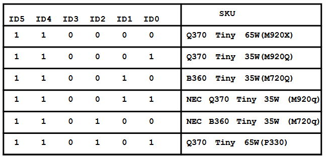
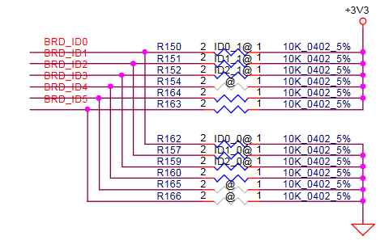
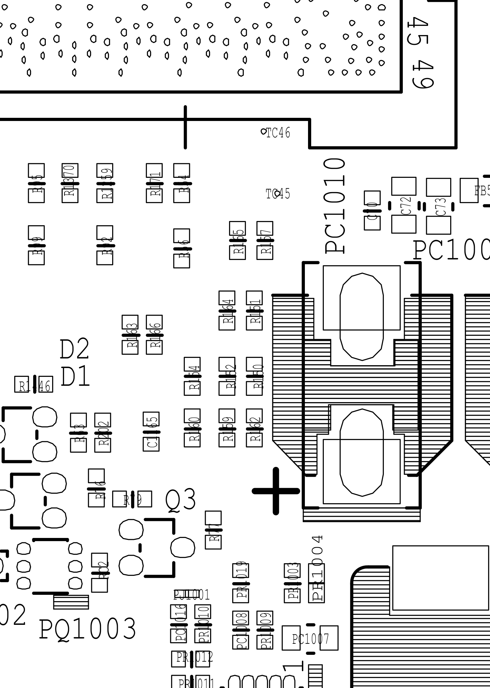
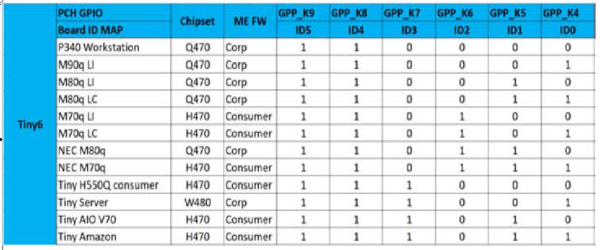
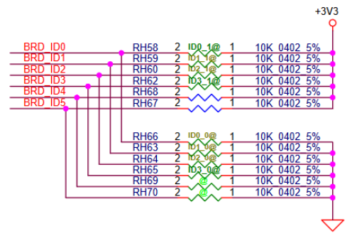
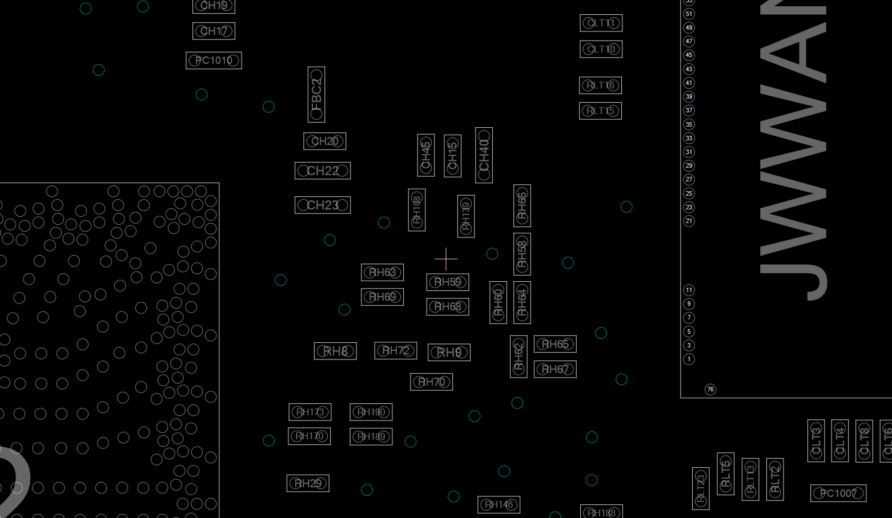

# Tiny secrets

Here is my research with as many technical details about Lenovo's, Dell's, HP's and Acer's small PCs as I can find  
There's some interesting modding opportunities that haven't been explored yet as far as I can tell, and I don't have access to most of the hardware to try it myself

Below is an overview of the different system boards used inside each model, with the shipped vs theoretical maximum potential configuration

See the boardpics directory for high-resolution images of each model's system board, taken from Lenovo's parts webpage

See the riserpics directory for images of each type of PCIe riser I'm aware of

# Lenovo Tiny Motherboard comparison table
###### lol this was a pain to format
| Model          | Class                | Generation  | Riser slot type            | Board name | Design | Model | Board code | CPU type               | Chipset | Memory type  | M-key slots | B-key slots | Comment                           |
|----------------|----------------------|-------------|----------------------------|------------|--------|-------|------------|------------------------|---------|--------------|-------------|-------------|-----------------------------------|
| M700 Tiny      | Entry, no vPro       | Tiny3       | None                       | IS1XX1H    | LiteON | JC110 |            | 6th gen                | B150    | 2x DDR4 2133 | 1 / 1       | 0 / 0       | Board name also IQ170IH1?         |
| M710q          | Entry, no vPro       | Tiny4       | Tiny4 x8 unpopulated       | IQ2X0IH    | LiteON | JC113 |            | 6th/7th gen            | B250    | 2x DDR4 2400 | 1 / 2       | 0 / 0       |                                   |
| M720q          | Entry, no vPro       | Tiny5       | Tiny5 x8+4                 | IQ3X0IL    | LCFC   | EQ370 | NM-B551    | 8th/9th gen            | B360    | 2x DDR4 2666 | 1 / 2       | 0 / 0       |                                   |
| M70q gen 1     | Entry, no vPro       | Tiny6       | Tiny6 x8+4 unpopulated     | IQ4X0IL1   | LCFC   | GH470 | NM-C621    | 10th gen               | H470    | 2x DDR4 2933 | 1 / 2       | 0 / 1       |                                   |
| M70q gen 2     | Entry, no vPro       | Tiny7       | Tiny6 x8+4 unpopulated     | IB5X0IL2   | LCFC   | HB560 | NM-D331    | 10th/11th gen          | B560    | 2x DDR4 3200?| 1 / 2       | 0 / 1       |                                   |
| M70q gen 3     | Entry, vPro          | Tiny8       | weird x4 unpopulated       | IQ6X0IL2   | LCFC   | HB660 | NM-D861    | 12th gen               | Q670    | 2x DDR4 3200 | 1 / 2       | 0 / 1       | Does have a vPro option?          |
| M70q gen 4     | Entry, vPro          | Tiny9?      | weird x4 unpopulated       | IQ6X0IL2   | LCFC   | KQ672 | NM-E871    | 13th gen               | Q670    | 2x DDR4 3200 | 1 / 2       | 0 / 1       | Also has vPro option              |
| M70q gen 5     | Entry, vPro          | Tiny10?     | None                       | IQ6X0IL4   | LCFC   | LQ672 | NM-F911    | 13th/14th gen          | Q670    | 2x DDR5 5600 | 2 / 2       | 0 / 0       | Totally different board layout    |
| M70q gen 6     | AI-PC                | Tiny11      | None                       | IQ870IL0   | LCFC   | MQ868 | NM-G361    | Ultra 200              | Q870    | 2x DDR5 5600 | 2 / 2       | 0 / 0       | New BTB connector                 |
|                |                      |             |                            |            |        |       |            |                        |         |              |             |             |                                   |
| M900 Tiny      | Entry, vPro          | Tiny3       | None                       | IS1XX1H    | LiteON | JC110 |            | 6th gen                | Q170    |              | 1 / 1       | 0 / 0       | Board name also IQ170IH1?         |
| M910q          | Entry, vPro          | Tiny4       | Tiny4 x8 unpopulated       | IQ2X0IH    | LiteON | JC113 |            | 6th/7th gen            | Q270    |              | 1 / 2       | 0 / 0       |                                   |
| M920q          | Entry, vPro          | Tiny5       | Tiny5 x8+4                 | IQ3X0IL    | LCFC   | EQ370 | NM-B551    | 8th/9th gen            | Q370    |              | 1 / 2       | 0 / 0       |                                   |
| M80q gen 1     | Entry, vPro          | Tiny6       | Tiny6 x8+4 unpopulated     | IQ4X0IL1   | LCFC   | GH470 | NM-C621    | 10th gen               | Q470    |              | 1 / 2       | 0 / 1       | Sometimes called M930q            |
| M80q gen 2     | doesn’t exist lmaooo |             |                            |            |        |       |            |                        |         |              |             |             | doesn't exist lmaooo              |
| M80q gen 3     | Entry, vPro          | Tiny8       | Tiny8 x8+4 unpopulated     | IQ6X0IL1   | LCFC   | HQ670 | NM-D581    | 12th gen               | Q670    |              | 2 / 2       | 0 / 1       |                                   |
| M80q gen 4     | Entry, vPro          | Tiny9?      | Tiny8 x8+4 unpopulated     | IQ6X0IL1   | LCFC   | KQ674 | NM-E881    | 13th gen               | Q670    |              | 2 / 2       | 0 / 1       |                                   |
|                |                      |             |                            |            |        |       |            |                        |         |              |             |             |                                   |
| M900x Tiny     | Performance, vPro    | Tiny3       | None                       | IS1XX1H    | LiteON | JC110 |            | 6th gen                | Q170    | 2x DDR4 2133 | 1 / 1       | 0 / 0       | Board name also IQ170IH1?         |
| M910x          | Performance, vPro    | Tiny4       | Tiny4 x8                   | IQ2X0IH    | LiteON | JC113 |            | 6th/7th gen            | Q270    | 2x DDR4 2400 | 2 / 2       | 0 / 0       |                                   |
| M920x          | Performance, vPro    | Tiny5       | Tiny5 x8+4                 | IQ3X0IL    | LCFC   | EQ370 | NM-B551    | 8th/9th gen            | Q370    | 2x DDR4 2666 | 2 / 2       | 0 / 0       |                                   |
| M90q gen 1     | Performance, vPro    | Tiny6       | Tiny6 x8+4                 | IQ4X0IL2   | LCFC   | GQ470 | NM-C901    | 10th gen               | Q470    | 2x DDR4 2933 | 2 / 2       | 0 / 1       |                                   |
| M90q gen 2     | Performance, vPro    | Tiny7       | Tiny6 x8+4                 | IQ5X0IL1   | LCFC   | HQ570 | NM-D321    | 10th/11th gen          | Q570    | 2x DDR4 3200 | 2 / 3       | 0 / 1       | Unpopulated 3rd M-key slot        |
| M90q gen 3     | Performance, vPro    | Tiny8       | Tiny8 x8+4                 | IQ6X0IL1   | LCFC   | HQ670 | NM-D581    | 12th gen               | Q670    | 2x DDR5 4800 | 2 / 2       | 0 / 1       | Sometimes called M950q            |
| M90q gen 4     | Performance, vPro    | Tiny9?      | Tiny8 x8+4                 | IQ6X0IL1   | LCFC   | KQ674 | NM-E881    | 13th gen               | Q670    | 2x DDR5 5600 | 2 / 2       | 0 / 1       |                                   |
| M90q gen 5     | Performance, vPro    | Tiny10      | Tiny8 x8+4                 | IQ6X0IL1   | LCFC   | LQ674 | NM-G071    | 13th/14th gen          | Q670    | 2x DDR5 5600 | 2 / 2       | 0 / 1       | Are these staying the same now?   |
| M90q gen 6     | AI-PC                | Tiny11      | Tiny8 x8+4?                | IQ870IL1   | LCFC   | LQ870?| NM-G181?   | Ultra 200              | Q870    | 2x DDR5 5600 | 3 / 3       | 0 / 0       | Same 3rd NVMe layout as gen 2     |
|                |                      |             |                            |            |        |       |            |                        |         |              |             |             |                                   |
| P320 Tiny      | Workstation, vPro    | Tiny4       | Tiny4 x8                   | IQ2X0IH    | LiteON | JC113 |            | 6th/7th gen            | Q270    |              | 2 / 2       | 0 / 0       |                                   |
| P330 Tiny      | Workstation, vPro    | Tiny5       | Tiny5 x8+4                 | IQ3X0IL    | LCFC   | EQ370 | NM-B551    | 8th/9th gen            | Q370    |              | 2 / 2       | 0 / 0       |                                   |
| P340 Tiny      | Workstation, vPro    | Tiny6       | Tiny6 x8+4                 | IQ4X0IL2   | LCFC   | GQ470 | NM-C901    | 10th gen               | Q470    |              | 2 / 2       | 0 / 1       |                                   |
| P350 Tiny      | Workstation, vPro    | Tiny7       | Tiny6 x8+4                 | IQ5X0IL1   | LCFC   | HQ570 | NM-D321    | 10th/11th gen          | Q570    |              | 2 / 3       | 0 / 1       | Unpopulated 3rd M-key slot        |
| P360 Tiny      | Workstation, vPro    | Tiny8       | Tiny8 x8+4                 | IQ6X0IL1   | LCFC   | HQ670 | NM-D581    | 12th gen               | Q670    |              | 2 / 2       | 0 / 1       |                                   |
| P3 Tiny        | Workstation, vPro    | Tiny9?      | Tiny8 x8+4                 | IQ6X0IL1   | LCFC   | KQ674 | NM-E881    | 13th/14th gen          | Q670    |              | 2 / 2       | 0 / 1       |                                   |
| P3 Tiny Gen 2  | AI-Ready Workstation | Tiny11?     | Tiny8 x8+4                 | IQ870IL1   | LCFC   | LQ870?| NM-G181    | Ultra 200              | Q870    | 2x DDR5 6400 | 3 / 3       | 0 / 0       | New BTB, 3x M-key, WWAN gone      |
|                |                      |             |                            |            |        |       |            |                        |         |              |             |             |                                   |
| P360 Ultra     | Workstation, vPro    | Tiny8?      | Ultra x16 riser + x8(x4) slot |         |        |       |            | 12th gen               | W680    | 4x DDR5 4800 | 2 / 2       | 0 / 0       | Board says 'Saiph' on it          |
| P3 Ultra       | Workstation, vPro    | Tiny9?      | Ultra x16 riser + x8(x4) slot | IW680IV |        |       |            | 12th/13th/14th gen     | W680    | 4x DDR5 4800 | 2 / 2       | 0 / 0       | Board says 'Saiph-R' on it        |
| P3 Ultra SFF Gen 2 | AI-Ready Workstation |         | Ultra x16/x8x8 riser + x8(x4) slot |    |        |       |            | Ultra 200              | W880    | 2x DDR5 6400 | 3 / 3       | 0 / 0       | Board says 'Petunia' on it        |
|                |                      |             |                            |            |        |       |            |                        |         |              |             |             |                                   |
| Neo Ultra      | Tiny studio workstation | Tiny10/TinyMax? | Looks like Tiny8 x8+4 | IQ6X0IL1 | LCFC   | LQ674 | NM-G071    | 14th gen               | Q670    |              | 2 / 2       | 0 / 1       | Same board as M90q Gen 5          |
| Neo Ultra 2025 | Tiny studio workstation | ?        | ?                          | ?          | ?      | ?     | ?          | Ultra 200?             | Q870?   | 2x DDR5 ?    | ?           | ?           |                                   |
|                |                      |             |                            |            |        |       |            |                        |         |              |             |             |                                   |
| M715q          | Entry, AMD           | Tiny3?      | None                       | AM4IH      | LiteON |       |            | PRO A6/A10/A12 8k/9k-E | B300    |              | 1 / 1       | 0 / 0       |                                   |
| M715q 2nd gen  | Entry, AMD           | Tiny3?      | None                       | AM4IH      | LiteON |       |            | ^ + Ryzen (PRO) 2k-GE  | B300    |              | 1 / 1       | 0 / 0       |                                   |
| M75q gen 1     | Entry, AMD           | Tiny5?      | None                       | AM4KIH     | LiteON |       |            | Ryzen PRO 2000/3000    | PRO 500 |              | 1 / 1       | 0 / 0       | Sometimes called M735q            |
| M75q gen 2     | Entry, AMD           | Tiny6?      | Tiny6 x4-only unpopulated  | AM4IV V1.0 | USI    |       |            | Ryzen PRO 3k/4k        | PRO 500 |              | 1 / 2       | 0 / 1       | Can flash v2 bios for 5000 support|
| M75q gen 2 v2? | Entry, AMD           | Tiny6?      | Tiny6 x4-only unpopulated  | AM4IV V1.2/V1.3| USI|       |            | Ryzen PRO (3k/4k/)?5k  | PRO 500 |              | 1 / 2       | 0 / 1       |                                   |
| M75q gen 5     | Entry, AMD           | Tiny8?      | None                       | AM5IL      | LCFC   | LKN30 | NM-F661    | Ryzen (PRO) 8000       | PRO 600 |              | 2 / 2       | 0 / 0       | An AMD one made by LCFC           |
|                |                      |             |                            |            |        |       |            |                        |         |              |             |             |                                   |
| Neo 50q gen 4  | lil office pc        | Tiny8?      | None                       | IRPLIL     | LCFC   | KH450 | NM-E951    | 13th gen Raptor Lake-H | SoC     |              | 1 / 2       | 0 / 0       | 1 / 2 ram slots on low end config |
| Neo 50q gen 5  | lil office pc        | ?           | None                       | IRPL_RIL   | LCFC   | MTY04/MTY05 | NM-G881 | Core 200 H          | SoC     | 2x DDR5 5600 | 2 / 2       | 0 / 0       | New BTB connector, 2nd on bottom? |
| Neo 50q QC     | lil office pc        | ?           | other weird x4 unpopulated | QX1PIL1    | LCFC   | LB380/MTYA0 | NM-G401 | Snapdragon X (Plus) | SoC     | 4x LPDDR5X   | 2 / 2       | 0 / 0       | Unpop x4 riser slot diff from M70q|
|                |                      |             |                            |            |        |       |            |                        |         |              |             |             |                                   |
| M90n-1 Nano    | cuteee               | ?           | None                       | IWHLNL     | LCFC   | FU420/FU421/FU422 | NM-C401 | 8.5th gen U   | SoC     | 0x DDR4 2400 | 2 / 2       | 0 / 1       | Says M930n and NANO1 on the board |
| M90n-1 Nano iot| cuteee               | ?           | None                       | IWHLNL     | LCFC   | FU420/FU421/FU422 | NM-C401 | 8.5th gen U   | SoC     | 0x DDR4 2400 | 2 / 2       | 0 / 1       | M90n but 2xCOM 2xLAN -1USB fanless|
| M75n           | cuteee               | ?           | None                       |            | LCFC   | GFP50/GFP51 | NM-C751 | Ryzen PRO 3000 U    | SoC     | 0x DDR4 2400 | 2 / 2       | 0 / 1       |                                   |
|                |                      |             |                            |            |        |       |            |                        |         |              |             |             |                                   |
| IdeaCentre 620S-03IKL     | lil office pc | Tiny4?  | Tiny2?? likely Tiny4 x8    | IB250IH    | LiteON |       |            | 7th gen                | B250    |              | 1 / 1       | 0 / 0       | Cursed B250 M910x without front io|
| IdeaCentre Mini 5 01IMH05 | lil office pc | Tiny6?  | Tiny6 x8+4 unpopulated     | IQ4X0IL1   | LCFC   | GH470 | NM-C621    | 10th gen               | H470    |              | 1 / 2       | 0 / 1       | Sometimes called T550q            |
| IdeaCentre Mini 5 01IAQ7  | lil office pc | Tiny8?  | weird x4 unpopulated       | IQ6X0IL2   | LCFC   | HB660 | NM-D861    | 12th gen               | Q670    |              | 1 / 2       | 0 / 1       | Missing one of the BTB ports      |
| IdeaCentre Mini 01IRH8    | lil office pc | Tiny8?  | None                       | IRPLIL     | LCFC   | KH450 | NM-E951    | 13th gen Raptor Lake-H | SoC     | 2x DDR4 3200 | 2 / 2       | 0 / 0       | Built in Thunderbolt 4            |
| IdeaCentre Mini 01Q8X10   | lil office pc | ?       | other weird x4 unpopulated | QX1PIL1    | LCFC   | LB380/MTYA0 | NM-G401 | Snapdragon X        | SoC     | 4x LPDDR5X   | 2 / 2       | 0 / 0       | Neo 50q QC with builtin psu & USB4|
| IdeaCentre Mini 01IRH10R  | lil office pc | ?       | None                       | IRPL_RIL   | LCFC   | MTY04/MTY05 | NM-G881 | Core 200 H          | SoC     | 2x DDR5 5600 | 2 / 2       | 0 / 0       | Neo50q gen5 with builtin psu & TB4|
|                |                      |             |                            |            |        |       |            |                        |         |              |             |             |                                   |
| ThinkEdge SE10 | Server               |             | None                       | IEHLNL     | LCFC   | KEHL0 | NM-F421    | Atom X Series          | SoC     | 2x DDR4 3200 | 1 / 1       | 2 / 2       |                                   |
| ThinkEdge SE30 | Server               |             | None                       | ITGLNL     | LCFC   | GTU00 | NM-D241    | 11th gen Tiger Lake    |         |              | 2 / 2       | 1 / 1       | board says NANO2 on it            |
| ThinkEdge SE50 | Server               | Tiny5?      | Tiny5 x4-only tall         | IWLUIA     |        |       |            | 8.5th gen U            | SoC     |              | 2 / 2       | 2 / 2       | 2 B-key slots but only 1 SIM slot |
| ThinkEdge SE70 | Server               |             | None                       |            |        |       |            | Nvidia Jetson Xavier NX| SoM     | 4x LPDDR4x   | 1 / 1       | 1 / 1       | I really (I really) like Nvidiiia♫|
| EPC300         | Server               | Tiny5?      | Tiny5 x4-only tall         | IWLUIA     |        |       |            | 8.5th gen U            | SoC     | 2x DDR4 ?    | 2 / 2       | 2 / 2       | Same as SE50 pretty much          |
|                |                      |             |                            |            |        |       |            |                        |         |              |             |             |                                   |
| M625q          | Idk it sucks lol     |             | None                       | FT4IH      | LiteON |       |            | AMD xx-9xxx            | SoC     |              | 1 / 1       | 0 / 0       |                                   |
| M630e          | Thin client          | Tiny5       | Tiny5 x4-only unpopulated  | IWLUIA     |        |       |            | 8.5th gen U            | SoC     |              | 1 / 2       | 0 / 2       | 1 / 2 SODIMM slots populated      |
| M60e           | A Little low power pc| Tiny6       | None                       | IICLUIV    | LiteON |       |            | 10th gen Ice Lake      | SoC     |              | 1 / 1       | 0 / 0       |                                   |
| M60q Chromebox | Chromebox lol        | Tiny8       | None                       | ILGOO      | Compal |       | LA-M541P   | 12th gen U             | SoC     |              | 1 / 1       | 0 / 0       | Wow they had Compal make one      |
|                |                      |             |                            |            |        |       |            |                        |         |              |             |             |                                   |
| ThinkSmart Core| Video conference unit|             | None                       | ITGLNL     | LCFC   | HU420 | NM-D411    | 11th gen Tiger Lake    | SoC     | 0x DDR4 3200 | 1 / 2       | 0 / 1       | Board looks the same as SE30      |
| ThinkSmart Core Gen 2| Video conference unit|       | None                       | LMLH2      | LCFC   |       | NM-G051    | Ultra 100              | SoC     | 2x DDR5 5600 | 1 / 1       | 0 / 1 ?     | HDMI input optional               |
| ThinkSmart Tiny Kit| Video conference unit|         | weird x4 unpopulated       | IQ6X0IL2   | LCFC   | KQ672 | NM-E871    | 13th gen               | Q670    | 2x DDR4 3200 | 1 / 2       | 0 / 1       | M70q gen 4 without DP and -1 USB3 |
| ThinkSmart Hub 500| Video conference unit|          | Tiny4 x8 unpopulated       | IQ270IH    | LiteON | ?     |            | 7th gen                | Q270    | 2x DDR4 2400 | 1 / 2       | 0 / 0       | M910q without front IO and 2x HDMI|
| ThinkSmart Hub | Video conference unit|             | None                       | IWHLNL     | LCFC   | FU423 | NM-C701    | 8.5th gen U            | SoC     | 0x DDR4 2400 | 1 / 2       | 0 / 1       | Modified M90n-1?                  |
| ThinkSmart One | Sound bar???         |             | None                       | ITGLNL     | LCFC   | HU420 | NM-D411    | 11th gen Tiger Lake    | SoC     | 0x DDR4 3200 | 1 / 2       | 0 / 1       | Core Gen 1 without DP and -2 USB3 |
|                |                      |             |                            |            |        |       |            |                        |         |              |             |             |                                   |
| ThinkCentre POS| POS                  | Tiny8?      | weird x4 unpopulated       | IQ6X0IL2   | LCFC   | HB660 | NM-D861    | 12th gen               | Q670    | 2x DDR4 3200 | 1 / 2       | 0 / 1       | Pretty much an M70q gen 3         |
|                |                      |             |                            |            |        |       |            |                        |         |              |             |             |                                   |

# BTB modules

todo

# Random extra notes

* Starting with the Tiny5 generation, the riser slot contains 2 PCIe links, a x8 link from the CPU and a x4 link from the PCH. The PCH link supports hot-plug (don't try it) and is for Thunderbolt support, the CPU link is for GPUs
* On the M90q gen 1 (NM-C901) schematic, the riser slot contains a bunch of extra IO for a supposed BMC card and riser with multiple slots (multiple refclks), possibly meant for unreleased server models?
* The M90q gen 1 schematic also has some extra IO on one of the M-key M.2 slots on the bottom, for some kind of dock-like device. Schematic mentions some special version for internal use at Amazon? Not sure if this is present on other models, no schematic available.
* M70q gen 1 and 2 boards are different from the M90q ones, but look nearly identical except for the CPU VRM config
* I'm not sure what the marketed difference between the M70q gen 3 and 4 and the M80q gen 3 and 4 is since they both support vPro
* Starting with the Tiny6 generation, most boards have unpopulated B-key M.2 WWAN and SIM card slots, might be meant for IoT/Edge/Server versions like the ThinkEdge SE50, but I can't find any other model beyond that one.
* The M90q gen 2 and P350 have an unpopulated footprint for a 3rd M-key M.2 NVMe slot, would be cool to try soldering that on and seeing if it works.

## Schematic observations / potential mods
### Board ID straps
Many of these boards have a set of resistor straps that are used to set the specific SKU of the system, they often share the same board and firmware. At its simplest there is of course the different tiers from the main series, but there's also some interesting options:  
* NEC variants are for the NEC rebranded versions of these systems, setting it reduces the amount of BIOS settings and changes the boot logo to the NEC logo
* Server and Amazon versions in the Tiny6 generation? Neither of these exist publicly as far as I know, I'd love to know more about them.
* Different versions of the M70q and M80q gen 1? (LI and LC)

> 
> 
> 

> ID straps from Tiny5 gen NM-B551

> 
> 
> 

> ID straps from Tiny6 gen NM-C901

### Power rail capacity
todo (add info about 12V rail capacity per generation)

### PSU ID / Current limiting circuit
todo

### Unpopulated / unused options
todo  
* VRM phases
* M.2 slots
* Sata ports
* Riser slots
* DC headers
* Fan headers
* more?

## Riser types
todo
### Official
todo
### 3rd party
todo
| Name              | Creator           | Compatibility                   | Riser slot type  | Slots                                                                                      | Other features                                  | Comment                                                                                                                    |
|-------------------|-------------------|---------------------------------|------------------|--------------------------------------------------------------------------------------------|-------------------------------------------------|----------------------------------------------------------------------------------------------------------------------------|
| Tinyriser v1      | WifiCable (me :3) | M720q, M920q, M920x, P330       | Tiny5 x8+4       | PCIe x16 (CPU, x8),  M-key M.2 (PCH, x4)                                                |                                                 |                                                                                                                            |
| Tinyriser v2      | WifiCable         | M720q, M920q, M920x, P330       | Tiny5 x8+4       | PCIe x16 (CPU, x8),  M-key M.2 (PCH, x4)                                                | Fan header, SSD activity LED                    |                                                                                                                            |
| Tinyriser v2.1    | WifiCable         | M720q, M920q, M920x, P330       | Tiny5 x8+4       | PCIe x16 (CPU, x8),  M-key M.2 (PCH, x4)                                                | Fan header, SSD activity LED                    |                                                                                                                            |
| Tinyriser6 v1     | WifiCable         | M90q gen 1, gen 2?, P340, P350? | Tiny6 x8+4       | PCIe x16 (CPU, x8),  M-key M.2 (PCH, x4)                                                | Fan header, SSD activity LED, USB port, misc IO | Work in progress, don't know if it'll work on Tiny7 yet                                                                    |
| Tiny5 M.2 Riser   | j4cbo             | M920q, M920x, P330              | Tiny5 x8+4       | PCIe x4 (open ended, CPU, x4),  M-key M.2 (CPU, x4),  M-key M.2 (PCH, x4)            | Fan header                                      | Requires motherboard mod for bifurcation                                                                                   |
| Tiny6-X4+M2+M2+TF | qq8322302         | M90q gen 1, P340                | Tiny6 x8+4       | PCIe x4 (open ended, CPU, x4),  M-key M.2 (CPU, x4),  M-key M.2 (PCH, x4)            | Fan header, MicroSD slot                        | Requires motherboard mod for bifurcation                                                                                   |
| Tiny4-X4M2SATA    | qq8322302         | M910q, M910x, P320              | Tiny4 x8         | PCIe x4 (open ended, CPU, x4),  M-key M.2 (CPU, x4),  M-key M.2 (SATA)               | Fan header                                      | Requires motherboard mod for bifurcation, uses SATA FFC for SATA M.2 slot                                                  |
| Tiny4-HPX4M2SATA  | qq8322302         | M910q, M910x, P320              | Tiny4 x8         | HP FlexLOM PCIe x4 (open ended, CPU, x4),  M-key M.2 (CPU, x4),  M-key M.2 (SATA)    | Fan header                                      | Requires motherboard mod for bifurcation, uses SATA FFC fpr SATA M.2 slot, PCIe slot only compatible with HP FlexLOM cards |
| Tiny5-X4M2M2      | qq8322302         | M920q, M920x, P330              | Tiny5 x8+4       | PCIe x4 (open ended, CPU, x4),  M-key M.2 (CPU, x4),  M-key M.2 (PCH, x4)            | Fan header                                      | Requires motherboard mod for bifurcation                                                                                   |
| Tiny5-HPX4M2M2    | qq8322302         | M920q, M920x, P330              | Tiny5 x8+4       | HP FlexLOM PCIe x4 (open ended, CPU, x4),  M-key M.2 (CPU, x4),  M-key M.2 (PCH, x4) | Fan header                                      | Requires motherboard mod for bifurcation, PCIe slot only compatible with HP FlexLOM cards                                  |
| Tiny5-X8M2SATA    | qq8322302         | M720q(?), M920q, M920x, P330    | Tiny5 x8+4       | PCIe x8 (open ended, CPU, x8),  M-key M.2 (PCH, x4),  M-key M.2 (SATA)               | Fan header                                      | Uses SATA FFC for SATA M.2 slot, creator says M720q is not compatible but I think it should work in there, no bifurcation  |

Links:  
Tinyriser:         https://github.com/a-little-wifi/Tinyriser  
Tinyriser6:        https://github.com/a-little-wifi/Tinyriser6 (still private)  
Tiny5 M.2 Riser:   https://github.com/j4cbo/tiny5-m2-riser  
Tiny6-X4+M2+M2+TF: https://github.com/qq8322302/Tiny6-P340-pcie-bifurcation-expansion-card  
Tiny4/Tiny5 qq8322302: https://github.com/qq8322302/Lenovo-Tiny-Serial-PCIE-Expansion-Card  

Pictures:  
https://github.com/a-little-wifi/TinySecrets/tree/main/riserpics  

## PCIe layout
todo  
### Tiny5:
#### M720q, M920q, M920x and P330 (NM-B551):
* DMI 3.0 x4 from CPU to PCH (B360 or Q370)
* Riser PCIe 3.0 x8 from CPU (lanes 0-7)
* Riser PCIe 3.0 x4 from PCH (lanes 9-12)
* SSD1 PCIe 3.0 x4 from PCH (lanes 21-24)
* SSD2 PCIe 3.0 x4 from PCH (lanes 17-20) (SATA support on lane 17) (PCIe not supported on B360/M720q, only SATA)
* 2.5" SATA 6Gb/s from PCH (lane 13)
* LAN PCIe 3.0 x1 from PCH (lane 5)
* Wifi PCIe 3.0 x1 from PCH (lane 6)
* BTB USB 3.0 from PCH (lane 1) (not supported on B360/M720q)

### Tiny6:
#### M70q gen 1 and M80q gen 1 (NM-C621):
* DMI 3.0 x4 from CPU to PCH (H470 or Q470)
* ?

#### P340 and M90q gen 1 (NM-C901):
* DMI 3.0 x4 from CPU to PCH (Q470)
* Riser PCIe 3.0 x8 from CPU (lanes 8-15)
* Riser PCIe 3.0 x4 from PCH (lanes 9-12)
* SSD1 PCIe 3.0 x4 from PCH (lanes 21-24)
* SSD2 PCIe 3.0 x4 from PCH (lanes 17-20) (SATA support on lane 17)
* 2.5" SATA 6Gb/s from PCH (lane 13)
* LAN PCIe 3.0 x1 from PCH (lane 5)
* Wifi PCIe 3.0 x1 from PCH (lane 6)
* BTB USB 3.0 from PCH (lane 1)
* USB-C USB 3.0 from PCH (lane 2)
* WWAN PCIe 3.0 x1 from PCH (lane 15)

### Tiny7:
#### P350 and M90q gen 2 (NM-D321):
* DMI 3.0 x8 from CPU to PCH (Q570)
* Riser PCIe 3.0 x8 from CPU (lanes 0-7)
* SSD1 PCIe 4.0 x4 from CPU (lanes ?-?)
* SSD2 PCIe 4.0 x4 from CPU (lanes ?-?)
* SSD3 PCIe 4.0? x4 from CPU (lanes 16-19) (unpopulated slot)
* Riser PCIe 3.0 x4 from PCH (lanes ?-?)
* 2.5" SATA 6Gb/s from PCH (lane ?)
* unpopulated SATA2 from PCH (lane ?)
* LAN PCIe 3.0 x1 from PCH (lane ?)
* Wifi PCIe 3.0 x1 from PCH (lane ?)
* WWAN PCIe 3.0 x1 from PCH (lane ?)

P350/M90q gen 2 has the NVMe slots connected to the CPU instead of the PCH, for PCIe 4.0 support (Q570 itself doesn't support PCIe 4.0, 11th gen CPUs do).  
Tiny7 is pretty awesome for SSD bandwidth, especially if you solder the 3rd slot.

### Tiny8:
#### NM-D581 Rev 0.5 prototype board:
* DMI 4.0 x8 from CPU to PCH (Q670 ES)
* Riser PCIe ?.0 x8 from CPU (lanes 8-15)

### Tiny9:
#### P3 Tiny and M90q gen 4 (NM-E881):
* DMI 4.0 x8 from CPU to PCH (Q670)
* Riser PCIe 4.0 x8 from CPU (lanes 0-7)
* SSD1 PCIe 4.0 x4 from PCH (lanes 21-24/25-28?)
* SSD2 PCIe 4.0 x4 from PCH (lanes 21-24/25-28?)
* Riser PCIe ?.0 x4 from PCH (lanes ?-?)
* 2.5" SATA 6Gb/s from PCH (lane ?)
* unpopulated SATA2 from PCH (lane ?)
* LAN PCIe ?.0 x1 fro PCH (lane ?)
* Wifi PCIe 3.0 x1 from PCH (lane 8)
* WWAN PCIe ?.0 x1 from PCH (lane ?)

> !! **Help requested:** If you have a machine not (completely) listed here running Windows, a screenshot of Device Manager in 'Devices by connection' mode or HWINFO showing all the PCIe devices and associated root ports would be very helpful for documenting this across all generations. (better to have as many slots populated as possible for this)

## NEC rebrands
todo

## Known prototype boards

| Generation  | Riser slot type            | Board name | Design | Model | Board code | Revision | Chipset | Memory type  | M-key slots | B-key slots | Comment                           |
|-------------|----------------------------|------------|--------|-------|------------|----------|---------|--------------|-------------|-------------|-----------------------------------|
| Tiny6       | Tiny6 x8+4 unpopulated     | IQ4X0IL    | LCFC   | GH470 | NM-C621    | 0.2      | H470?   | 2x DDR4      | 1 / 2       | 0 / 1       |                                   |
| Tiny7       | Tiny6 x8+4                 | IQ5X0Il1   | LCFC   | HQ570 | NM-D321    | 0.5      | Q570?   |              | 3 / 3       | 1 / 1       |                                   |
| Tiny7       | Tiny6 x8+4                 | IQ5X0Il1   | LCFC   | HQ570 | NM-D321    | 0.4      | Q570?   |              | 3 / 3       | 0 / 1       | has some 0Ω jumpers where rev 1.0 has them embedded in the pcb |
| Tiny8       | Tiny8 x8+4                 | IQ6X0IL1   | LCFC   | HQ670 | NM-D581    | 0.5      | Q670?   | 2x DDR5      | 3 / 3       | 1 / 1       |                                   |

## Parts links with hi-res images

 Click here to view links 

https://pcsupport.lenovo.com/nl/en/products/desktops-and-all-in-ones/thinkcentre-m-series-desktops/thinkcentre-m700-tiny/10hy/parts/display/compatible  
https://pcsupport.lenovo.com/nl/en/products/desktops-and-all-in-ones/thinkcentre-m-series-desktops/thinkcentre-m710q/10mr/parts/display/compatible  
https://pcsupport.lenovo.com/us/en/products/desktops-and-all-in-ones/thinkcentre-m-series-desktops/m720q/10t7/parts/display/compatible  
https://pcsupport.lenovo.com/nl/en/products/desktops-and-all-in-ones/thinkcentre-m-series-desktops/m70q/11dt/parts/display/compatible  
https://pcsupport.lenovo.com/nl/en/products/desktops-and-all-in-ones/thinkcentre-m-series-desktops/thinkcentre-m70q-gen-2/11n3/parts/display/compatible  
https://pcsupport.lenovo.com/nl/en/products/desktops-and-all-in-ones/thinkcentre-m-series-desktops/thinkcentre-m70q-gen-3/11t3/parts/display/compatible  
https://pcsupport.lenovo.com/nl/en/products/desktops-and-all-in-ones/thinkcentre-m-series-desktops/thinkcentre-m70q-gen-4/12e6/parts/display/compatible  
https://pcsupport.lenovo.com/bl/en/products/desktops-and-all-in-ones/thinkcentre-m-series-desktops/thinkcentre-m70q-gen-5/12td/parts/display/compatible  
https://pcsupport.lenovo.com/nl/en/products/desktops-and-all-in-ones/thinkcentre-m-series-desktops/thinkcentre-m70q-gen-6/13a4/parts/display/compatible  

https://pcsupport.lenovo.com/nl/en/products/desktops-and-all-in-ones/thinkcentre-m-series-desktops/thinkcentre-m900/10fc/parts/display/compatible  
https://pcsupport.lenovo.com/nl/en/products/desktops-and-all-in-ones/thinkcentre-m-series-desktops/thinkcentre-m910q/10mv/parts/display/compatible  
https://pcsupport.lenovo.com/nl/en/products/desktops-and-all-in-ones/thinkcentre-m-series-desktops/thinkcentre-m920q/10rr/parts/display/compatible  
https://pcsupport.lenovo.com/nl/en/products/desktops-and-all-in-ones/thinkcentre-m-series-desktops/thinkcentre-m80q/11dn/parts/display/compatible  
https://pcsupport.lenovo.com/nl/en/products/desktops-and-all-in-ones/thinkcentre-m-series-desktops/thinkcentre-m80q-gen-3/11u1/parts/display/compatible  
https://pcsupport.lenovo.com/nl/en/products/desktops-and-all-in-ones/thinkcentre-m-series-desktops/thinkcentre-m80q-gen-4/12ea/parts/display/compatible  

https://pcsupport.lenovo.com/nl/en/products/desktops-and-all-in-ones/thinkcentre-m-series-desktops/thinkcentre-m900x/10lx/parts/display/compatible  
https://pcsupport.lenovo.com/nl/en/products/desktops-and-all-in-ones/thinkcentre-m-series-desktops/thinkcentre-m910x/10my/parts/display/compatible  
https://pcsupport.lenovo.com/nl/en/products/desktops-and-all-in-ones/thinkcentre-m-series-desktops/thinkcentre-m920x/10s0/parts/display/compatible  
https://pcsupport.lenovo.com/nl/en/products/desktops-and-all-in-ones/thinkcentre-m-series-desktops/thinkcentre-m90q/11dh/parts/display/compatible  
https://pcsupport.lenovo.com/nl/en/products/desktops-and-all-in-ones/thinkcentre-m-series-desktops/thinkcentre-m90q-gen-2/11mq/parts/display/compatible  
https://pcsupport.lenovo.com/nl/en/products/desktops-and-all-in-ones/thinkcentre-m-series-desktops/thinkcentre-m90q-gen-3/11u6/parts/display/compatible  
https://pcsupport.lenovo.com/nl/en/products/desktops-and-all-in-ones/thinkcentre-m-series-desktops/thinkcentre-m90q-gen-4/12eh/parts/display/compatible  
https://pcsupport.lenovo.com/bl/en/products/desktops-and-all-in-ones/thinkcentre-m-series-desktops/thinkcentre-m90q-gen-5/12th/parts/display/compatible  
https://pcsupport.lenovo.com/nl/en/products/desktops-and-all-in-ones/thinkcentre-m-series-desktops/thinkcentre-m90q-gen-6/13ac/parts/display/compatible  

https://pcsupport.lenovo.com/nl/en/products/workstations/thinkstation-p-series-workstations/thinkstation-p320-tiny/30c2/parts/display/compatible  
https://pcsupport.lenovo.com/nl/en/products/workstations/thinkstation-p-series-workstations/thinkstation-p330-tiny/30cf/parts/display/compatible  
https://pcsupport.lenovo.com/nl/en/products/workstations/thinkstation-p-series-workstations/thinkstation-p340-tiny/30df/parts/display/compatible  
https://pcsupport.lenovo.com/nl/en/products/workstations/thinkstation-p-series-workstations/thinkstation-p350-tiny/30eg/parts/display/compatible  
https://pcsupport.lenovo.com/nl/en/products/workstations/thinkstation-p-series-workstations/thinkstation-p360-tiny/30f8/parts/display/compatible  
https://pcsupport.lenovo.com/nl/en/products/workstations/thinkstation-p-series-workstations/thinkstation-p3-tiny/30h2/parts/display/compatible  
https://pcsupport.lenovo.com/nl/en/products/workstations/thinkstation-p-series-workstations/tihnkstation-p3-tiny-gen-2/30k3/parts/display/compatible  

https://pcsupport.lenovo.com/nl/en/products/workstations/thinkstation-p-series-workstations/thinkstation-p360-ultra/30g2/parts/display/compatible  
https://pcsupport.lenovo.com/nl/en/products/workstations/thinkstation-p-series-workstations/thinkstation-p3-ultra/30ha/parts/display/compatible  
https://pcsupport.lenovo.com/nl/en/products/workstations/thinkstation-p-series-workstations/thinkstation-p3-ultra-sff-gen-2/30j3/parts/display/compatible  

https://pcsupport.lenovo.com/us/en/products/desktops-and-all-in-ones/thinkcentre-neo-series-desktops/thinkcentre-neo-ultra/12w1/parts/display/compatible  

https://pcsupport.lenovo.com/nl/en/products/desktops-and-all-in-ones/thinkcentre-m-series-desktops/m715q/10m2/parts/display/compatible  
https://pcsupport.lenovo.com/nl/en/products/desktops-and-all-in-ones/thinkcentre-m-series-desktops/m715q-2nd-gen/10vg/parts/display/compatible  
https://pcsupport.lenovo.com/us/en/products/desktops-and-all-in-ones/thinkcentre-m-series-desktops/m75q-1/11a4/parts/display/compatible  
https://pcsupport.lenovo.com/us/en/products/desktops-and-all-in-ones/thinkcentre-m-series-desktops/thinkcentre-m75q-gen-2/11jj/parts/display/compatible  
https://pcsupport.lenovo.com/us/en/products/desktops-and-all-in-ones/thinkcentre-m-series-desktops/thinkcentre-m75q-gen-5/12rq/parts/display/compatible  

https://pcsupport.lenovo.com/nl/en/products/desktops-and-all-in-ones/thinkcentre-neo-series-desktops/thinkcentre-neo-50q-gen-4/12lh/parts/display/compatible  
https://pcsupport.lenovo.com/nl/en/products/desktops-and-all-in-ones/thinkcentre-neo-series-desktops/thinkcentre-neo-50q-gen-5/13b9/parts/display/compatible  
https://pcsupport.lenovo.com/nl/en/products/desktops-and-all-in-ones/thinkcentre-neo-series-desktops/thinkcentre-neo-50q-qc/13c8/parts/display/compatible  

https://pcsupport.lenovo.com/nl/en/products/desktops-and-all-in-ones/thinkcentre-m-series-desktops/thinkcentre-m90n-1/11ad/parts/display/compatible  
https://pcsupport.lenovo.com/nl/en/products/desktops-and-all-in-ones/thinkcentre-m-series-desktops/thinkcentre-m75n/11bs/parts/display/compatible  

https://pcsupport.lenovo.com/nl/en/products/desktops-and-all-in-ones/600-series/620s-03ikl/90hc/parts/display/compatible  
https://pcsupport.lenovo.com/nl/en/products/desktops-and-all-in-ones/5-series/mini-5-01imh05/90q6/parts/display/compatible  
https://pcsupport.lenovo.com/nl/en/products/desktops-and-all-in-ones/5-series/ideacentre-mini-5-01iaq7/90ub/parts/display/compatible  
https://pcsupport.lenovo.com/nl/en/products/desktops-and-all-in-ones/5-series/lenovo-ideacentre-mini-01irh8/90w2/parts/display/compatible  
https://pcsupport.lenovo.com/nl/en/products/desktops-and-all-in-ones/5-series/ideacentre-mini-01q8x10/91b6/parts/display/compatible  
https://pcsupport.lenovo.com/nl/en/products/desktops-and-all-in-ones/5-series/ideacentre-mini-01irh10r/91b2/parts/display/compatible  

https://smartsupport.lenovo.com/nl/en/products/smart/smart-edge/thinkedge-se10/12nh/parts/display/compatible  
https://smartsupport.lenovo.com/nl/en/products/smart/smart-edge/thinkedge-se30/11na/parts/display/compatible  
https://smartsupport.lenovo.com/us/en/products/smart/smart-edge/thinkedge-se50/11rj/parts/display/compatible  
https://smartsupport.lenovo.com/nl/en/products/smart/smart-edge/thinkedge-se70/12a6/parts/display/compatible  
https://smartsupport.lenovo.com/nl/en/products/smart/commercial-iot/epc300/11b3/parts/display/compatible  

https://pcsupport.lenovo.com/us/en/products/desktops-and-all-in-ones/thinkcentre-m-series-desktops/thinkcentre-m625q/10tj/parts/display/compatible  
https://pcsupport.lenovo.com/us/en/products/desktops-and-all-in-ones/thinkcentre-m-series-desktops/thinkcentre-m630e/10ym/parts/display/compatible  
https://pcsupport.lenovo.com/nl/en/products/desktops-and-all-in-ones/thinkcentre-m-series-desktops/thinkcentre-m60e-tiny/11lu/parts/display/compatible  
https://pcsupport.lenovo.com/nl/en/products/desktops-and-all-in-ones/chromebox/thinkcentre-m60q-chromebox/12c6/parts/display/compatible  

https://smartsupport.lenovo.com/nl/en/products/smart/smart-collaboration/thinksmart-core-ip-controller-full-room-kit-microsoft-teams-rooms/12qn/parts/display/compatible  
https://smartsupport.lenovo.com/nl/en/products/smart/smart-collaboration/thinksmart-core-gen-2-and-ip-controller-room-kits/12we/parts/display/compatible  
https://smartsupport.lenovo.com/nl/en/products/smart/smart-collaboration/thinksmart-tiny-kit/12xh/parts/display/compatible  
https://smartsupport.lenovo.com/nl/en/products/smart/smart-collaboration/thinksmart-hub-500/10v5/parts/display/compatible  
https://smartsupport.lenovo.com/nl/en/products/smart/smart-collaboration/thinksmart-hub-zoom/11h2/parts/display/compatible  
https://smartsupport.lenovo.com/nl/en/products/smart/smart-collaboration/thinksmart-one-ip-controller-microsoft-teams-rooms/12bw/parts/display/compatible  

https://smartsupport.lenovo.com/nl/en/products/smart/smart-retail/thinkcentre-pos/12su/parts/display/compatible  

# Dell Optiplex Micro/MFF and Precision Compact/CFF

| Series    | Model              | Riser slot type      | Board name                 | Design   | Model  | Board code | CPU type      | Chipset | Memory type  | M-key slots | Comment                                                        |
|-----------|--------------------|----------------------|----------------------------|----------|--------|------------|---------------|---------|--------------|-------------|----------------------------------------------------------------|
| Optiplex  | 3020M              | None                 | Dogfish_Entry              | Wistron  | PIH81R | 13124-1    | 4th gen       | H81     | 2x DDR3L     | 0 / 1       |                                                                |
| Optiplex  | 3040 Micro         | None                 | ?                          | ?        |        |            | 6th gen       | H110    | 2x DDR3L     | 0 / 1       | Maybe made by Foxconn?                                         |
| Optiplex  | 3050 Micro         | None                 | D8-MFF-BF                  | Pegatron |        |            | 6th/7th gen   | B250    | 2x DDR4 2400 | 1 / 1       |                                                                |
| Optiplex  | 3060 Micro         | None                 | IPCFL-CG                   | Pegatron |        |            | 8th gen       | H370    | 2x DDR4 2666 | 1 / 1       |                                                                |
| Optiplex  | 3070 Micro         | None                 | D9.5_MFF IPCFL-CG          | Pegatron |        |            | 8th/9th gen   | H370    | 2x DDR4 2666 | 1 / 1       | Same as 3060 Micro                                             |
| Optiplex  | 3080 Micro         | None                 | IPCML-CT                   | Pegatron |        |            | 10th gen      | B460    | 2x DDR4 2666 | 1 / 1       |                                                                |
| Optiplex  | 3090 Micro         | None                 | IPCML-RN/ZB                | Pegatron |        |            | 10th gen      | Q470    | 2x DDR4 2666 | 1 / 2       | why Q470?                                                      |
| Optiplex  | 3000 Micro         | None                 | D1? ADL 6L                 | Wistron  | 0FJ05? | ??_040-1A  | 12th gen      | B660    | 2x DDR4 3200 | 1 / 2       | Back to Wistron lol (also it's yellow)                         |
|           |                    |                      |                            |          |        |            |               |         |              |             |                                                                |
| Optiplex  | 5050 Micro         | None                 | D8-MFF-AF                  | Pegatron |        |            | 6th/7th gen   | Q270    | 2x DDR4 2400 | 1 / 1       | 3050 Micro but Q270 and more USB3                              |
| Optiplex  | 5060 Micro         | None                 | IPCFL-BS/EK                | Pegatron |        |            | 8th gen       | Q370    | 2x DDR4 2666 | 1 / 1       | 3060 Micro but Q370, USB-C, more USB3 and 2x DP                |
| Optiplex  | 5070 Micro         | None                 | IPCFL-BS/EK                | Pegatron |        |            | 8th/9th gen   | Q370    | 2x DDR4 2666 | 1 / 1       | Same as 5060 Micro                                             |
| Optiplex  | 5080 Micro         | None                 | IPCML-RN/ZB                | Pegatron |        |            | 10th gen      | Q470    | 2x DDR4 2666 | 1 / 2       | Same as 3090 Micro but with extra front USB-C                  |
| Optiplex  | 5090 Micro         | None                 | IPRKL-BO/CB                | Pegatron |        |            | 10th/11th gen | Q570    | 2x DDR4 3200 | 1 / 2       |                                                                |
| Optiplex  | 5000 Micro         | None                 | D12 ADL 6L                 | Wistron  | 0FJ04? | 202040-1A  | 12th gen      | Q670    | 2x DDR4 3200 | 1 / 2       | 3000 Micro but Q670, front/rear(option) USB-C, 2xDP, more USB3 |
|           |                    |                      |                            |          |        |            |               |         |              |             |                                                                |
| Optiplex  | 7040 Micro         | None                 | ?                          | ?        |        |            | 6th gen       | Q170    | 2x DDR4 2133 | 1 / 1       | Same as 3040 Micro but Q170, DDR4, more USB3, M-key populated  |
| Optiplex  | 7050 Micro         | None                 | D8-MFF-SF                  | Pegatron |        |            | 6th/7th gen   | Q270    | 2x DDR4 2400 | 1 / 1       | Same as 3050 Micro but Q270, USB-C and more USB3               |
| Optiplex  | 7050 Micro 65W     | None                 | D8-MFF-SF65                | Pegatron |        |            | 6th/7th gen   | Q270    | 2x DDR4 2400 | 1 / 1       | 7050 Micro with more CPU VRM phases for 65W CPU?               |
| Optiplex  | 7060 Micro         | None                 | IPCFL-BS/EK                | Pegatron |        |            | 8th gen       | Q370    | 2x DDR4 2666 | 1 / 1       | Identical to the 5060 Micro?                                   |
| Optiplex  | 7060 Micro 65W     | None                 | IPCFL-BS 65W               | Pegatron |        |            | 8th gen       | Q370    | 2x DDR4 2666 | 1 / 1       | 7060 Micro with more CPU VRM phases for 65W CPU?               |
| Optiplex  | 7070 Micro         | None                 | IPCFL-BS/EK                | Pegatron |        |            | 8th/9th gen   | Q370    | 2x DDR4 2666 | 1 / 1       | Same as 7060 Micro                                             |
| Optiplex  | 7070 Micro 65W     | None                 | IPCFL-BS 65W               | Pegatron |        |            | 8th/9th gen   | Q370    | 2x DDR4 2666 | 1 / 1       | Same as 7060 Micro 65W                                         |
| Optiplex  | 7080 Micro         | None                 | IPCML-RN/ZB                | Pegatron |        |            | 10th gen      | Q470    | 2x DDR4 2933 | 2 / 2       | Same as 5080 Micro but 2x M-key and higher memory rating?      |
| Optiplex  | 7080 Micro 65W     | PCIe x8 unpopulated  | IPCML-RN65/DGFX            | Pegatron |        |            | 10th gen      | Q470    | 2x DDR4 2933 | 2 / 2       | Same as GPU one, but 6 VRM phases for 65W, no PCIe slot, 5x USB3 |
| Optiplex  | 7080 Micro GPU     | PCIe x8 single width | IPCML-RN65/DGFX            | Pegatron |        |            | 10th gen      | Q470    | 2x DDR4 2933 | 2 / 2       | Same as 65W one, but 4 VRM phases for 35W, PCIe slot, 4x USB3  |
| Optiplex  | 7090 Micro         | None                 | IPRKL-BO/CB                | Pegatron |        |            | 10th/11th gen | Q570    | 2x DDR4 3200 | 2 / 2       | Same as 5090 Micro but 2x M-key                                |
| Optiplex  | 7090 Micro 65W     | PCIe x8 unpopulated  | IPRKL-BO65/DGFX            | Pegatron |        |            | 10th/11th gen | Q570    | 2x DDR4 3200 | 2 / 2       | Same as 7080 Micro 65W but Q570                                |
| Optiplex  | 7090 Micro GPU     | PCIe x8 single width | IPRKL-BO65/DGFX            | Pegatron |        |            | 10th/11th gen | Q570    | 2x DDR4 3200 | 2 / 2       | Same as 7080 Micro GPU but Q570                                |
| Optiplex  | 7000 Micro 35W     | None                 | D1? ADL 6L HF              | Wistron  | 0FK10? | ??_007-1A  | 12th gen      | Q670    | 2x DDR4 3200 | 2 / 2       | Similar but not quite a 5000 Micro?                            |
| Optiplex  | 7000 Micro 65W     | PCIe x8 unpopulated  | D12 ADL 8L                 | Wistron  | 0FF08? | 202008-1A  | 12th gen      | Q670    | 2x DDR5 4800 | 2 / 2       | 3x DP                                                          |
| Optiplex  | Micro 7010         | None                 | D13 MF? Lu?                | Wistron  | 0G803? | ??2045-??  | 12th/13th gen | Q670    | 2x DDR4 3200 | 1 / 2       | DP + HDMI, one M-key populated. Is this 5000 series rebranded? |
| Optiplex  | Micro Plus 7010    | PCIe x8 unpopulated  | D12 ADL 8L 3rd X01         | Wistron  | 0FF15? | 222016-SB  | 13th gen      | Q670    | 2x DDR5 4800 | 2 / 2       | 3x DP                                                          |
| Optiplex  | Micro 7020         | None                 | OPTI 3 D13.5 MFF LUXOR-LOW | Wistron  | 0HH03? | 222035-1A  | 12th/14th gen | Q670    | 2x DDR5 5600 | 2 / 2       | Back to 2x M-key and got DDR5 now                              |
| Optiplex  | Micro Plus 7020    | PCIe x8 unpopulated  | D13.5 MFF Luxor High       | Wistron  | 0HG04? | 232014-SA  | 14th gen      | Q670    | 2x DDR5 5600 | 2 / 2       | 3x DP                                                          |
| Dell Pro  | Micro QCM1250 14g  |                      |                            | ?        | ?      | ?          | 14th gen      | Q670    | 2x DDR5 5600 | 2 / ?       |                                                                |
| Dell Pro  | Micro QCM1250      | None                 |                            | Wistron  | ?      | 232023-1A  | Ultra 200     | Q870    | 2x DDR5 6400 | 2 / 2       |                                                                |
| Dell Pro  | Micro Plus QBM1250 | Custom unpopulated   |                            | Wistron  | 0JG04? | 232024-1A  | Ultra 200     | Q870    | 2x DDR5 6400 | 2 / 2       |                                                                |
|           |                    |                      |                            |          |        |            |               |         |              |             |                                                                |
|           |                    |                      |                            |          |        |            |               |         |              |             |                                                                |
|           |                    |                      |                            |          |        |            |               |         |              |             |                                                                |
| Optiplex  | 9020M              | None                 | ?                          | ?        | ?      | ?          | 4th gen       | Q87     | 2x DDR3L     | 1 / 1       | Looks like the 3020M but with M-key populated and more USB3    |
|           |                    |                      |                            |          |        |            |               |         |              |             |                                                                |
| Precision | 3240 Compact       | PCIe x8 double width | IPCML-RN65/DGFX            | Pegatron |        |            | 10th gen      | W480    | 2x DDR4 3200 | 2 / 2       | Same board as 7080 Micro 65W/GPU but fully featured            |
| Precision | 3260 Compact       | PCIe x8 double width | D12 ADL 8L                 | Wistron  | 0FF07? | 202008-1A  | 12th/13th gen | W680    | 2x DDR5 5600 | 2 / 2       | Same board as 7000 Micro 65W but with PCIe populated           |
| Precision | 3280 CFF           | PCIe x8 + x1 Custom  |                            | Wistron  | 0HF03? | 222043-1A  | 14th gen      | W680    | 2x DDR5 5600 | 2 / 2       | Fully custom board with weird PCIe riser slot                  |
| Dell Pro  | Max Micro FCM2250  | PCIe x8 + x1 Custom  |                            | Wistron  | 0JG03? | 232024-1A  | Ultra 200     | W880    | 2x DDR5 6400 | 2 / 2       | Same board as Micro Plus QBM1250 but with riser slot populated |

## Spec pdfs:

 Click here to view links 

https://i.dell.com/sites/doccontent/shared-content/data-sheets/en/Documents/OptiPlex-3050-Towers-Technical-Specifications.pdf  
https://data.technimax.cz/attach/artilky/dell-optiplex-3070-specs-sheet.pdf  

https://i.dell.com/sites/csdocuments/Shared-Content_data-Sheets_Documents/en/OptiPlex-5050-Towers-Technical-Specifications.pdf  
https://dl.dell.com/topicspdf/optiplex-5060-desktop_specifications3_en-us.pdf  
https://www.bhphotovideo.com/lit_files/584704.pdf  
https://i.dell.com/sites/csdocuments/Merchandizing_Docs/en/optiplex-5080-spec-sheet.pdf  
https://dl.dell.com/topicspdf/optiplex-5090-desktop_owners-manual3_en-us.pdf  
https://doi-product-assets.s3.amazonaws.com/pub/User-Manual/1073775889.pdf  

https://www.delltechnologies.com/asset/en-us/products/desktops-and-all-in-ones/technical-support/optiplex-micro-spec-sheet.pdf  
https://i.dell.com/sites/csdocuments/Shared-Content_data-Sheets_Documents/en/OptiPlex-7050-Towers-Technical-Specifications.pdf  
https://c-data.co.il/Content/Images/uploaded/OptiPlex%207050%20Towers%20Technical%20Specifications.pdf  
https://dl.dell.com/topicspdf/optiplex-7060-desktop_specifications3_en-us.pdf  
https://www.dignited.com/wp-content/uploads/2022/05/opti7070-micro-setup-specs-en-us.pdf  
https://hardware-corner.net/wp-content/uploads/2021/02/dell-optiplex-7080-datasheet.pdf  
https://dl.dell.com/content/manual16805704-optiplex-7080-micro-setup-and-specifications-guide.pdf  
https://dl.dell.com/content/manual46045081-optiplex-7080-micro-service-manual.pdf  
https://www.informatika.com/wp-content/uploads/2021/09/optiplex-7090-towers-spec-sheet.pdf  
https://dl.dell.com/content/manual18875407-optiplex-7090-micro-form-factor-service-manual.pdf  
https://doi-product-assets.s3.amazonaws.com/pub/User-Manual/1077151049.pdf  
https://dl.dell.com/content/manual21273838-optiplex-7000-micro-service-manual.pdf  
https://www.delltechnologies.com/asset/en-us/products/desktops-and-all-in-ones/technical-support/optiplex-micro-7010-technical-guidebook.pdf  
https://dl.dell.com/content/manual17424428-optiplex-micro-7010-owner-s-manual.pdf  
https://dl.dell.com/content/manual17560719-optiplex-micro-plus-7010-owner-s-manual.pdf  
https://dl.dell.com/content/manual43193729-optiplex-micro-7020-owner-s-manual.pdf  
https://dl.dell.com/content/manual32906471-optiplex-micro-plus-7020-owner-s-manual.pdf  
https://dl.dell.com/content/manual27439440-dell-pro-micro-qcm1250-owner-s-manual.pdf  
https://dl.dell.com/content/manual21252292-dell-pro-micro-plus-qbm1250-owner-s-manual.pdf  

https://dl.dell.com/topicspdf/optiplex-9020m-desktop_owners-manual_en-us.pdf  

https://dl.dell.com/content/manual24399514-precision-3240-compact-setup-and-specifications.pdf  
https://dl.dell.com/topicspdf/precision-3240-workstation_owners-manual_en-us.pdf  
https://dl.dell.com/content/manual34204451-precision-3260-compact-setup-and-specifications.pdf  
https://dl.dell.com/content/manual27296999-precision-3260-compact-service-manual.pdf  
https://dl.dell.com/content/manual23490351-precision-3280-cff-owner-s-manual.pdf  
https://dl.dell.com/content/manual37202989-dell-pro-max-micro-fcm2250-owner-s-manual.pdf  

# HP EliteDesk and ProDesk Mini

todo

| Series    | Model           | Expansion slots      | Board name                 | Design   | Model  | Board code        | CPU type      | Chipset | Memory type  | M-key slots | Comment                                                  |
|-----------|-----------------|----------------------|----------------------------|----------|--------|-------------------|---------------|---------|--------------|-------------|----------------------------------------------------------|
| ProDesk   | 400 G1 Mini     | None                 | BILBO                      | Foxconn? |        |                   | 4th gen       | H81     | 2x DDR3L     | 1 / 1       |                                                          |
| ProDesk   | 400 G2 Mini     | None                 | DINO                       | Foxconn? |        |                   | 6th gen       | H110    | 2x DDR4 2133 | 1 / 1       |                                                          |
| ProDesk   | 400 G3 Mini     | Flex IO v1           | Virgo MB Rev A             | Wistron  | 07N02? | 16514-1           | 6th/7th gen   | H270    | 2x DDR4 2400 | 1 / 1       |                                                          |
| ProDesk   | 400 G4 Mini     | Flex IO v1           | Mandolin Rev A             | Quanta   | F80    | DA0F80MB6A0 REV:A | 8th gen       | B360    | 2x DDR4 2666 | 1 / 1       |                                                          |
| ProDesk   | 400 G5 Mini     | Flex IO v1           | Mandolin-R Rev 0A          | Quanta   | F80B   | DAF80BMB6D0 REV:D | 8th/9th gen   | B360    | 2x DDR4 2666 | 1 / 1       |                                                          |
| ProDesk   | 400 G6 Mini     | Flex IO v2, 2nd      | Missandei Rev A            | Quanta   | F91    | DA0F91MB6F0 REV:F | 10th gen      | Q470    | 2x DDR4 2933 | 1 / 2       | Unpopulated dGPU connector and why Q470??? (again??)     |
| Pro       | Mini 400 G9     | Flex IO v?           | ?                          | Quanta   | F96    | DA0F96MB8F0 REV:F | 12/13/14th gen| Q670    | 2x DDR4 ?    | 1 / 2       | Unpopulated dGPU connector and why Q670???               |
|           |                 |                      |                            |          |        |                   |               |         |              |             |                                                          |
| ProDesk   | 600 G1 Mini     | None                 | FRODO                      | Foxconn? |        |                   | 4th gen       | Q85     | 2x DDR3L     | 1 / 1       | Looks identical to 400 G1 Mini with extra DP populated   |
| ProDesk   | 600 G2 Mini     | Serial/DP option     | DOLOMITE REV A             | Foxconn? |        |                   | 6th gen       | Q150    | 2x DDR4 2133 | 1 / 1       |                                                          |
| ProDesk   | 600 G3 Mini     | Flex IO v1           | Scorpius Rev A             | Wistron  | 06N35  | 16515-1           | 6th/7th gen   | Q270    | 2x DDR4 2400 | 1 / 1       |                                                          |
| ProDesk   | 600 G4 Mini     | Flex IO v1           | Harp/Lute Rev A            | Quanta   | F81    | DA0F81MB6A0 REV:A | 8th gen       | Q370    | 2x DDR4 2666 | 2 / 2       |                                                          |
| ProDesk   | 600 G5 Mini     | Flex IO v1           | Harp-R/Lute-R REV.0A       | Quanta   | F81B   | DAF81BMB6D0 REV:D | 8th/9th gen   | Q370    | 2x DDR4 2666 | 2 / 2       | Looks identical to 600 G4 Mini                           |
| ProDesk   | 600 G6 Mini     | Flex IO v2, 2nd      | Drogo Daario -AUD Rev. B   | Quanta   | F93    | DAF93MB26B0 REV:B | 10th gen      | Q470    | 2x DDR4 2933 | 2 / 2       | Unpopulated dGPU connector                               |
| ProDesk   | 600 G8 Mini     | ?                    | ?                          | ?        | ?      | ?                 | ?             | ?       | ?            | ?           | Its existence is implied but there is like no info???    |
| Elite     | Mini 600 G9     | ?                    | ?                          | ?        | ?      | ?                 | 12th/13th gen | Q670    | 2x DDR5 4800?| 2 / 2?      | Too new, not much info yet                               |
|           |                 |                      |                            |          |        |                   |               |         |              |             |                                                          |
| EliteDesk | 800 G1 Mini     | None                 | FRODO                      | Foxconn? |        |                   | 4th gen       | Q87     | 2x DDR3L     | 1 / 1       | Same as 600 G1 Mini but with Q87 and more USB3           |
| EliteDesk | 800 G2 Mini     | Serial/DP option     | DOLOMITE REV A             | Foxconn? |        |                   | 6th gen       | Q170    | 2x DDR4 2133 | 1 / 1       | Same as 600 G2 Mini but with Q170 and more USB3          |
|           |                 |                      |                            |          |        |                   |               |         |              |             |                                                          |
| EliteDesk | 8 Mini G1i      | Flex IO v3, 2nd ?    |                            |          |        |                   | Ultra 200     | Q870    | 2x DDR5 5600 | 3 / 3 ?     |                                                          |
|           |                 |                      |                            |          |        |                   |               |         |              |             |                                                          |
| Z2        | Mini G1i        | Flex IO v?           |                            |          |        |                   | Ultra 200     | W880    | 2x DDR5 6400 | 2 / 2 ?     |                                                          |
|           |                 |                      |                            |          |        |                   |               |         |              |             |                                                          |
| ProDesk   | 405 G8 Mini     |                      |                            |          |        |                   |               |         |              |             |                                                          |
| EliteDesk | 800 G1 USDT     | MXM                  |                            |          |        |                   |               |         | 2x DDR3L     | 1x mSATA    |                                                          |
| ?         | 260 G1          | None                 | ?                          | ?        | ?      | ?                 | 4th gen U     | SoC     | 2x DDR3L     | 1 / 1       |                                                          |

-- note: don't forget random 700 models

## Spec links

 Click here to view links 

Why'd HP take down all the older spec pages SMH

400 G1: https://web.archive.org/web/20210917143329/https://support.hp.com/us-en/document/c04564879  
400 G2: https://web.archive.org/web/20210920075058/https://support.hp.com/ie-en/document/c04843458  
400 G3: https://web.archive.org/web/20210924223229/https://support.hp.com/us-en/document/c05364056  
https://www.bargainhardware.co.uk/media/quick-specs/desktops/HP-ProDesk-400-G3-Mini-Quick-Specs.pdf  
400 G4: https://web.archive.org/web/20220111065823/https://support.hp.com/us-en/document/c06047054  
400 G5: https://web.archive.org/web/20210613003747/https://support.hp.com/us-en/document/c06403257  
https://www8.hp.com/h20195/v2/GetPDF.aspx/4AA7-5394EEAP.pdf  
400 G6: https://www8.hp.com/h20195/v2/GetPDF.aspx/c06640086.pdf  
400 G9: https://h20195.www2.hp.com/v2/GetPDF.aspx/c08161382.pdf  

600 G1: https://www.hp.com/hpinfo/newsroom/press_kits/2013/HPDiscoverBarcelona/ProDesk_600_G1_Desktop_Mini_QuickSpecs.pdf  
600 G2: https://web.archive.org/web/20211119121706/https://support.hp.com/us-en/document/c04819833  
600 G3: https://content.etilize.com/Manufacturer-Brochure/1061323301.pdf  
600 G4: https://web.archive.org/web/20230326103332/https://support.hp.com/us-en/document/c06057132  
600 G5: https://web.archive.org/web/20240603170755/https://support.hp.com/ca-en/document/c06403574  
https://www8.hp.com/h20195/v2/GetPDF.aspx/4AA7-5393EEAP.pdf  
600 G6: https://www8.hp.com/h20195/v2/GetPDF.aspx/c06640111.pdf  
600 G9: https://h20195.www2.hp.com/v2/GetPDF.aspx/c08050134.pdf  

800 G1: https://www.hp.com/hpinfo/newsroom/press_kits/2013/HPDiscoverBarcelona/EliteDesk800G1_Desktop_Mini_Datasheet.pdf  
800 G2: https://h30434.www3.hp.com/psg/attachments/psg/HardwareDPC/221621/1/HP%20EliteDesk%20800%20G2%20QuickSpecs%20v31.pdf  

8 G1i: https://kaas.hpcloud.hp.com/pdf-public/pdf_12049039_en-US-1.pdf

Z2 G1i: https://kaas.hpcloud.hp.com/pdf-public/pdf_12080525_en-US-1.pdf

kaas :sob:

HP part search with images: https://partsurfer.hp.com

## Flex IO module overview

todo

# Acer Veriton N

todo

| Model           | Expansion slots                               | Board name                 | Design   | Model  | Board code | CPU type      | Chipset | Memory type  | M-key slots | Comment                                         |
|-----------------|-----------------------------------------------|----------------------------|----------|--------|------------|---------------|---------|--------------|-------------|-------------------------------------------------|
| N4630G          | PCIe x1, ?                                    |                            |          |        |            | 4th gen       | H81     | 2x DDR3L     | 0 / 0       |                                                 |
| N4640G          | PCIe x16, ?                                   |                            |          |        |            | 6th/7th gen   | H110    | 2x DDR4 2400 | 1 / 1       |                                                 |
| N4660G          | PCIe x16, SATA box, Display/USB/Serial option | PIQ37L-Copperbox           | Wistron  | 0BB09? | 17557-1N   | 8th/9th gen   | B360    | 2x DDR4 2666 | 2 / 2       |                                                 |
| N4670G          |                                               |                            |          |        |            |               |         |              |             |                                                 |
| N4670GT?        |                                               |                            |          |        |            |               |         |              |             |                                                 |
| N4680GT         | PCIe x16, ?                                   | PIQ57L-VRABOOT             | Wistron  | 0ET08? | 202017-1A  | 10th/11th gen | B560    | 2x DDR4 ?    | 1 / ?       |                                                 |
| N4690GT         |                                               |                            |          |        |            |               |         |              |             |                                                 |
| N4710GT         |                                               |                            |          |        |            |               |         |              |             |                                                 |
| VN4720GT        |                                               |                            |          |        |            |               |         |              |             |                                                 |
|                 |                                               |                            |          |        |            |               |         |              |             |                                                 |
| N6660G          | PCIe x16, SATA box, Display/USB/Serial option | PIQ37L-Copperbox           | Wistron  | 0BB09? | 17557-1N   | 8th/9th gen   | Q370    | 2x DDR4 2666 | 2 / 2       | Same as N4660G but with Q370 and more USB3      |
| N6680G          | PCIe x16, SATA box, Display/USB/Serial option |                            |          |        |            | 11th gen      |         | 2x DDR4 3200 | 2 / ?       |                                                 |
| VN6710GT        | PCIe x16, ?                                   |                            |          |        |            | ?/13th/? gen  |         |              |             |                                                 |
| VN6720GT        | PCIe x16, SATA box, Display/USB/Serial option | PIQ67L-vAbraR MB           | Wistron  | 0HA03? | 232007-1   | ?/13/14th gen | B760    | 2x DDR5 4800?| 2 / ?       |                                                 |
|                 |                                               |                            |          |        |            |               |         |              |             |                                                 |
| Chromebox CXI5  | ?                                             | PIADLL-MOLI MB             | Wistron  | 0FV06? | 212050-1A  | 12th/? gen U  | SoC     | 2x ?         | 2 / ?       | one m-key is 2230 for emmc                      |
|                 |                                               |                            |          |        |            |               |         |              |             |                                                 |
# Schematics

Currently available schematics I know about:

- ThinkCentre M720q/M920q/M920x + ThinkStation P330 Tiny
- ThinkCentre M90q gen 1 + ThinkStation P340 Tiny
- ThinkCentre M75q gen 1
- ThinkCentre M75q gen 2
- ThinkCentre M90n-1 Nano
- ThinkCentre M700/M900/M900x Tiny

- Optiplex 3070 Micro
- Optiplex 5050 Micro

- Acer Veriton N4660G

If you're looking for one of these, feel free to email me at the address listed on my profile, I'll gladly send them to you.

# In case you wanna help out

I'm always looking for more schematics/boardviews and information about any unique parts, configs, mods and models (non-Lenovo too). If you have or know about anything you think might be of interest here, I'd love to hear about it in an issue on this repo or in my email listed on my profile. Thanks!

# More todo:
download Lenovo PSREF, Dell owners/service manual, HP Quickspec, Acer Lifecycle Extension Guide PDFs into repo