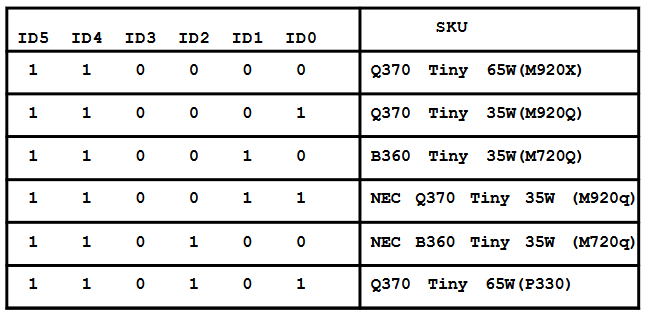
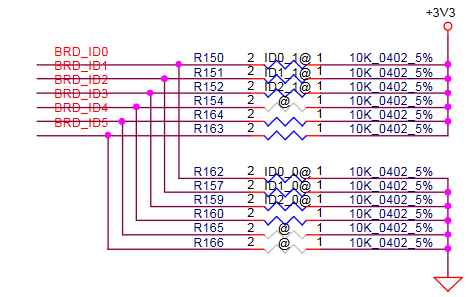
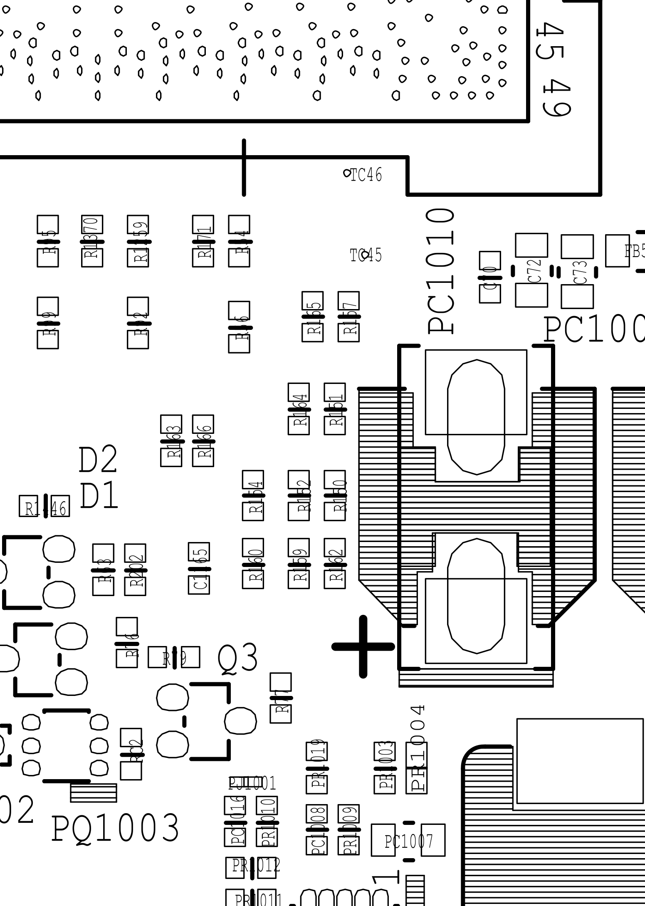
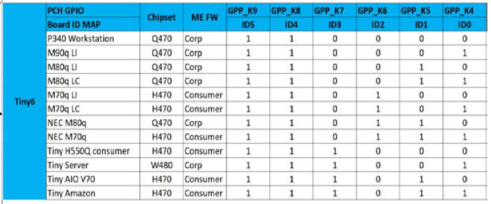
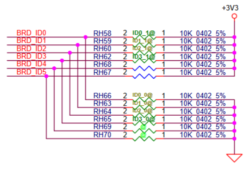
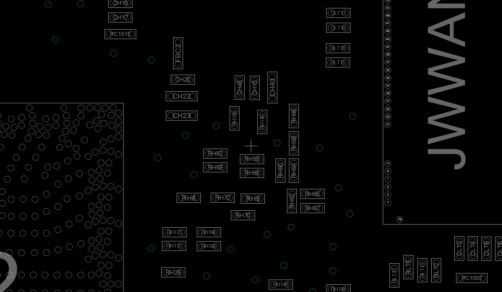

# Tiny secrets

Here is my research with as many technical details about Lenovo's small PCs as I can find  
There's some interesting modding opportunities that haven't been explored yet as far as I can tell, and I don't have access to most of the hardware to try it myself

Below is an overview of the different system boards used inside each model, with the shipped vs theoretical maximum potential configuration

See the boardpics directory for high-resolution images of each model's system board, taken from Lenovo's parts webpage

See the riserpics directory for images of each type of PCIe riser I'm aware of

# Lenovo Tiny Motherboard comparison table
###### lol this was a pain to format
| Model          | Class                | Generation  | Riser slot type            | Board name | Design | Board model | Board code | CPU type               | Chipset | M-key slots | B-key slots | Comment                           |
|----------------|----------------------|-------------|----------------------------|------------|--------|-------------|------------|------------------------|---------|-------------|-------------|-----------------------------------|
| M700 Tiny      | Entry, no vPro       | Tiny3       | None                       | IS1XX1H    | LiteON |             |            | 6th gen                | B150    | 1 / 1       | 0 / 0       |                                   |
| M710q          | Entry, no vPro       | Tiny4       | Tiny4 x8 unpopulated       | IQ2X0IH    | LiteON | JC113       |            | 6th/7th gen            | B250    | 1 / 2       | 0 / 0       |                                   |
| M720q          | Entry, no vPro       | Tiny5       | Tiny5 x8+4                 | IQ3X0IL    | LCFC   | EQ370       | NM-B551    | 8th/9th gen            | B360    | 1 / 2       | 0 / 0       |                                   |
| M70q gen 1     | Entry, no vPro       | Tiny6       | Tiny6 x8 unpopulated       | IQ4X0IL1   | LCFC   | GH470       | NM-C621    | 10th gen               | H470    | 1 / 2       | 0 / 1       |                                   |
| M70q gen 2     | Entry, no vPro       | Tiny7       | Tiny6 x8 unpopulated       | IB5X0IL2   | LCFC   | HB560       | NM-D331    | 10th/11th gen          | B560    | 1 / 2       | 0 / 1       |                                   |
| M70q gen 3     | Entry, no vPro       | Tiny8       | weird x4 unpopulated       | IQ6X0IL2   | LCFC   | HB660       | NM-D861    | 12th gen               | Q670    | 1 / 2       | 0 / 1       | Does have a vPro option?          |
| M70q gen 4     | Entry, no vPro       | Also Tiny8? | weird x4 unpopulated       | IQ6X0IL2   | LCFC   | KQ672       | NM-E871    | 13th gen               | Q670    | 1 / 2       | 0 / 1       | Also has vPro option              |
|                |                      |             |                            |            |        |             |            |                        |         |             |             |                                   |
| M900 Tiny      | Entry, vPro          | Tiny3       | None                       | IS1XX1H    | LiteON |             |            | 6th gen                | Q170    | 1 / 1       | 0 / 0       |                                   |
| M910q          | Entry, vPro          | Tiny4       | x8 no riser                | IQ2X0IH    | LiteON | JC113       |            | 6th/7th gen            | Q270    | 1 / 2       | 0 / 0       |                                   |
| M920q          | Entry, vPro          | Tiny5       | Tiny5 x8+4                 | IQ3X0IL    | LCFC   | EQ370       | NM-B551    | 8th/9th gen            | Q370    | 1 / 2       | 0 / 0       |                                   |
| M80q gen 1     | Entry, vPro          | Tiny6       | Tiny6 x8 unpopulated       | IQ4X0IL1   | LCFC   | GH470       | NM-C621    | 10th gen               | Q470    | 1 / 2       | 0 / 1       | Sometimes called M930q            |
| M80q gen 2     | doesn’t exist lmaooo |             |                            |            |        |             |            |                        |         |             |             | doesn't exist lmaooo              |
| M80q gen 3     | Entry, vPro          | Tiny8       | Tiny8 x8+4 unpopulated     | IQ6X0IL1   | LCFC   | HQ670       | NM-D581    | 12th gen               | Q670    | 2 / 2       | 0 / 1       |                                   |
| M80q gen 4     | Entry, vPro          | Also Tiny8? | Tiny8 x8+4 unpopulated     | IQ6X0IL1   | LCFC   | KQ674       | NM-E881    | 13th gen               | Q670    | 2 / 2       | 0 / 1       |                                   |
|                |                      |             |                            |            |        |             |            |                        |         |             |             |                                   |
| M900x Tiny     | Performance, vPro    | Tiny3       | None                       | IS1XX1H    | LiteON |             |            | 6th gen                | Q170    | 1 / 1       | 0 / 0       | M900 but it shipped with 65W CPUs |
| M910x          | Performance, vPro    | Tiny4       | Tiny4 x8                   | IQ2X0IH    | LiteON | JC113       |            | 6th/7th gen            | Q270    | 2 / 2       | 0 / 0       |                                   |
| M920x          | Performance, vPro    | Tiny5       | Tiny5 x8+4                 | IQ3X0IL    | LCFC   | EQ370       | NM-B551    | 8th/9th gen            | Q370    | 2 / 2       | 0 / 0       |                                   |
| M90q gen 1     | Performance, vPro    | Tiny6       | Tiny6 x8+4                 | IQ4X0IL2   | LCFC   | GQ470       | NM-C901    | 10th gen               | Q470    | 2 / 2       | 0 / 1       |                                   |
| M90q gen 2     | Performance, vPro    | Tiny7       | Tiny6 x8+4                 | IQ5X0IL1   | LCFC   | HQ570       | NM-D321    | 10th/11th gen          | Q570    | 2 / 3       | 0 / 1       | Unpopulated 3rd M-key slot        |
| M90q gen 3     | Performance, vPro    | Tiny8       | Tiny8 x8+4                 | IQ6X0IL1   | LCFC   | HQ670       | NM-D581    | 12th gen               | Q670    | 2 / 2       | 0 / 1       | Sometimes called M950q            |
| M90q gen 4     | Performance, vPro    | Also Tiny8? | Tiny8 x8+4                 | IQ6X0IL1   | LCFC   | KQ674       | NM-E881    | 13th gen               | Q670    | 2 / 2       | 0 / 1       |                                   |
|                |                      |             |                            |            |        |             |            |                        |         |             |             |                                   |
| P320 Tiny      | Workstation, vPro    | Tiny4       | Tiny4 x8                   | IQ2X0IH    | LiteON | JC113       |            | 6th/7th gen            | Q270    | 2 / 2       | 0 / 0       |                                   |
| P330 Tiny      | Workstation, vPro    | Tiny5       | Tiny5 x8+4                 | IQ3X0IL    | LCFC   | EQ370       | NM-B551    | 8th/9th gen            | Q370    | 2 / 2       | 0 / 0       |                                   |
| P340 Tiny      | Workstation, vPro    | Tiny6       | Tiny6 x8+4                 | IQ4X0IL2   | LCFC   | GQ470       | NM-C901    | 10th gen               | Q470    | 2 / 2       | 0 / 1       |                                   |
| P350 Tiny      | Workstation, vPro    | Tiny7       | Tiny6 x8+4                 | IQ5X0IL1   | LCFC   | HQ570       | NM-D321    | 10th/11th gen          | Q570    | 2 / 3       | 0 / 1       | Unpopulated 3rd M-key slot        |
| P360 Tiny      | Workstation, vPro    | Tiny8       | Tiny8 x8+4                 | IQ6X0IL1   | LCFC   | HQ670       | NM-D581    | 12th gen               | Q670    | 2 / 2       | 0 / 1       |                                   |
| P3 Tiny        | Workstation, vPro    | Also Tiny8? | Tiny8 x8+4                 | IQ6X0IL1   | LCFC   | KQ674       | NM-E881    | 13th/14th gen          | Q670    | 2 / 2       | 0 / 1       |                                   |
|                |                      |             |                            |            |        |             |            |                        |         |             |             |                                   |
| P360 Ultra     | Workstation, vPro    | Tiny8?      | P360/P3 Ultra specific     |            |        |             |            | 12th gen               | W680    | 2 / 2       | 0 / 0       | Board says 'Saiph' on it          |
| P3 Ultra       | Workstation, vPro    | Also Tiny8? | P360/P3 Ultra specific     | IW680IV    |        |             |            | 12th/13th/14th gen     | W680    | 2 / 2       | 0 / 0       | Board says 'Saiph-R' on it        |
|                |                      |             |                            |            |        |             |            |                        |         |             |             |                                   |
| ThinkSmart Core| Video confernce unit |             | None                       | ITGLNL     | LCFC   | HU420       | NM-D411    | 11th gen Tiger Lake    |         | 1 / 2       | 0 / 1       | Board looks the same as SE30      |
| ThinkEdge SE30 | Server               |             | None                       | ITGLNL     | LCFC   | GTU00       | NM-D241    | 11th gen Tiger Lake    |         | 2 / 2       | 1 / 1       |                                   |
| ThinkEdge SE50 | Server               | Tiny?       | Tiny5 x4-only tall         | IWLUIA     |        |             |            | 8th gen U              | SoC     | 2 / 2       | 2 / 2       | 2 B-key slots but only 1 SIM slot |
| M630e          | Thin client          | Tiny5       | Tiny5 x4-only unpopulated  | IWLUIA     |        |             |            | 8th gen U              | SoC     | 1 / 2       | 0 / 2       | 1 / 2 SODIMM slots populated      |
| M625q          | Idk it sucks lol     |             | None                       | FT4IH      | LiteON |             |            | AMD xx-9xxx            | SoC     | 1 / 1       | 0 / 0       |                                   |
| Neo 50q gen 4  | lil office pc        | Tiny8?      | None                       | IRPLIL     | LCFC   | KH450       | NM-E951    | 13th gen Raptor Lake-H | SoC     | 1 / 2       | 0 / 0       | 1 / 2 ram slots on low end config |
| M60q Chromebox | Chromebox lol        | Tiny8       | None                       | ILGOO      | Compal |             | LA-M541P   | 12th gen U             | SoC     | 1 / 1       | 0 / 0       | Wow they had Compal make one      |
| M60e           | A Little low power pc| Tiny6       | None                       | IICLUIV    | LiteON |             |            | 10th gen Ice Lake      | SoC     | 1 / 1       | 0 / 0       |                                   |
|                |                      |             |                            |            |        |             |            |                        |         |             |             |                                   |
| M715q          | Entry, AMD           | Tiny3?      | None                       | AM4IH      | LiteON |             |            | PRO A6/A10/A12 8k/9k-E | B300    | 1 / 1       | 0 / 0       |                                   |
| M715q 2nd gen  | Entry, AMD           | Tiny3?      | None                       | AM4IH      | LiteON |             |            | ^ + Ryzen (PRO) 2k-GE  | B300    | 1 / 1       | 0 / 0       |                                   |
| M75q gen 1     | Entry, AMD           | Tiny5?      | None                       | AM4KIH     | LiteON |             |            | Ryzen PRO 2000/3000    | PRO 500 | 1 / 1       | 0 / 0       |                                   |
| M75q gen 2     | Entry, AMD           | Tiny6?      | Tiny6? x4-only unpopulated | AM4IV      |        |             |            | Ryzen PRO 3k/4k/5k     | PRO 500 | 1 / 2       | 0 / 1       |                                   |
| M75q gen 5     | Entry, AMD           | Tiny8?      | None                       | AM5IL      | LCFC   | LKN30       | NM-F661    | Ryzen (PRO) 8000       | PRO 600 | 2 / 2       | 0 / 0       | An AMD one made by LCFC           |
|                |                      |             |                            |            |        |             |            |                        |         |             |             |                                   |
| IdeaCentre 620S-03IKL     | lil office pc | Tiny4?  | Tiny2?? likely Tiny4 x8    | IB250IH    | LiteON |             |            | 7th gen                | B250    | 1 / 1       | 0 / 0       | Cursed B250 M910x without front io|
| IdeaCentre Mini 01IRH8    | lil office pc |         | None                       | IRPLIL     | LCFC   | KH450       | NM-E951    | 13th gen Raptor Lake-H | SoC     | 2 / 2       | 0 / 0       |                                   |
| IdeaCentre Mini 5 01IAQ7  | lil office pc | Tiny8?  | weird x4 unpopulated       | IQ6X0IL2   | LCFC   | HB660       | NM-D861    | 12th gen               | Q670    | 1 / 2       | 0 / 1       | Missing one of the BTB ports      |
| IdeaCentre Mini 5 01IMH05 | lil office pc | Tiny6?  | Tiny6 x8 unpopulated       | IQ4X0IL1   | LCFC   | GH470       | NM-C621    | 10th gen               | H470    | 1 / 2       | 0 / 1       | Sometimes called T550q            |
|                |                      |             |                            |            |        |             |            |                        |         |             |             |                                   |
| Neo Ultra      | Tiny studio workstation | Tiny8/TinyMax? | Looks like Tiny8 x8+4 | IQ6X0IL1  | LCFC   | LQ674       | NM-G071    | 14th gen               | Q670    | 2 / 2       | 0 / 1       | Same board name as M90q Gen 4     |

# Random extra notes

* Starting with the Tiny5 generation, the riser slot contains 2 PCIe links, a x8 link from the CPU and a x4 link from the PCH. The PCH link supports hot-plug (don't try it) and is for Thunderbolt support, the CPU link is for GPUs
* On the M90q gen 1 (NM-C901) schematic, the riser slot contains a bunch of extra IO for a supposed BMC card and riser with multiple slots (multiple refclks), possibly meant for unreleased server models?
* The M90q gen 1 schematic also has some extra IO on one of the M-key M.2 slots on the bottom, for some kind of dock-like device. Schematic mentions some special version for internal use at Amazon? Not sure if this is present on other models, no schematic available.
* M70q gen 1 and 2 boards are different from the M90q ones, but look nearly identical except for the CPU VRM config
* I'm not sure what the marketed difference between the M70q gen 3 and 4 and the M80q gen 3 and 4 is since they both support vPro
* Starting with the Tiny6 generation, most boards have unpopulated B-key M.2 WWAN and SIM card slots, might be meant for IoT/Edge/Server versions like the ThinkEdge SE50, but I can't find any other model beyond that one.
* The M90q gen 2 and P350 have an unpopulated footprint for a 3rd M-key M.2 NVMe slot, would be cool to try soldering that on and seeing if it works.

# Schematic observations
## Board ID straps
Many of these boards have a set of resistor straps that are used to set the specific SKU of the system, they often share the same board and firmware. At its simplest there is of course the different tiers from the main series, but there's also some interesting options:  
* NEC variants are for the NEC rebranded versions of these systems, setting it reduces the amount of BIOS settings and changes the boot logo to the NEC logo
* Server and Amazon versions in the Tiny6 generation? Neither of these exist publicly as far as I know, I'd love to know more about them.
* Different versions of the M70q and M80q gen 1? (LI and LC)

> 
> 
> 

> ID straps from Tiny5 gen NM-B551

> 
> 
> 

> ID straps from Tiny6 gen NM-C901

## Power rail capacity
todo

## PSU ID / Current limiting circuit
todo

# Parts links with hi-res images

https://pcsupport.lenovo.com/nl/en/products/desktops-and-all-in-ones/thinkcentre-m-series-desktops/thinkcentre-m700-tiny/10hy/parts/display/compatible  
https://pcsupport.lenovo.com/nl/en/products/desktops-and-all-in-ones/thinkcentre-m-series-desktops/thinkcentre-m710q/10mr/parts/display/compatible  
https://pcsupport.lenovo.com/us/en/products/desktops-and-all-in-ones/thinkcentre-m-series-desktops/m720q/10t7/parts/display/compatible  
https://pcsupport.lenovo.com/nl/en/products/desktops-and-all-in-ones/thinkcentre-m-series-desktops/m70q/11dt/parts/display/compatible  
https://pcsupport.lenovo.com/nl/en/products/desktops-and-all-in-ones/thinkcentre-m-series-desktops/thinkcentre-m70q-gen-2/11n3/parts/display/compatible  
https://pcsupport.lenovo.com/nl/en/products/desktops-and-all-in-ones/thinkcentre-m-series-desktops/thinkcentre-m70q-gen-3/11t3/parts/display/compatible  
https://pcsupport.lenovo.com/nl/en/products/desktops-and-all-in-ones/thinkcentre-m-series-desktops/thinkcentre-m70q-gen-4/12e6/parts/display/compatible  

https://pcsupport.lenovo.com/nl/en/products/desktops-and-all-in-ones/thinkcentre-m-series-desktops/thinkcentre-m900/10fc/parts/display/compatible  
https://pcsupport.lenovo.com/nl/en/products/desktops-and-all-in-ones/thinkcentre-m-series-desktops/thinkcentre-m910q/10mv/parts/display/compatible  
https://pcsupport.lenovo.com/nl/en/products/desktops-and-all-in-ones/thinkcentre-m-series-desktops/thinkcentre-m920q/10rr/parts/display/compatible  
https://pcsupport.lenovo.com/nl/en/products/desktops-and-all-in-ones/thinkcentre-m-series-desktops/thinkcentre-m80q/11dn/parts/display/compatible  
https://pcsupport.lenovo.com/nl/en/products/desktops-and-all-in-ones/thinkcentre-m-series-desktops/thinkcentre-m80q-gen-3/11u1/parts/display/compatible  
https://pcsupport.lenovo.com/nl/en/products/desktops-and-all-in-ones/thinkcentre-m-series-desktops/thinkcentre-m80q-gen-4/12ea/parts/display/compatible  

https://pcsupport.lenovo.com/nl/en/products/desktops-and-all-in-ones/thinkcentre-m-series-desktops/thinkcentre-m900x/10lx/parts/display/compatible  
https://pcsupport.lenovo.com/nl/en/products/desktops-and-all-in-ones/thinkcentre-m-series-desktops/thinkcentre-m910x/10my/parts/display/compatible  
https://pcsupport.lenovo.com/nl/en/products/desktops-and-all-in-ones/thinkcentre-m-series-desktops/thinkcentre-m920x/10s0/parts/display/compatible  
https://pcsupport.lenovo.com/nl/en/products/desktops-and-all-in-ones/thinkcentre-m-series-desktops/thinkcentre-m90q/11dh/parts/display/compatible  
https://pcsupport.lenovo.com/nl/en/products/desktops-and-all-in-ones/thinkcentre-m-series-desktops/thinkcentre-m90q-gen-2/11mq/parts/display/compatible  
https://pcsupport.lenovo.com/nl/en/products/desktops-and-all-in-ones/thinkcentre-m-series-desktops/thinkcentre-m90q-gen-3/11u6/parts/display/compatible  
https://pcsupport.lenovo.com/nl/en/products/desktops-and-all-in-ones/thinkcentre-m-series-desktops/thinkcentre-m90q-gen-4/12eh/parts/display/compatible  

https://pcsupport.lenovo.com/nl/en/products/workstations/thinkstation-p-series-workstations/thinkstation-p320-tiny/30c2/parts/display/compatible  
https://pcsupport.lenovo.com/nl/en/products/workstations/thinkstation-p-series-workstations/thinkstation-p330-tiny/30cf/parts/display/compatible  
https://pcsupport.lenovo.com/nl/en/products/workstations/thinkstation-p-series-workstations/thinkstation-p340-tiny/30df/parts/display/compatible  
https://pcsupport.lenovo.com/nl/en/products/workstations/thinkstation-p-series-workstations/thinkstation-p350-tiny/30eg/parts/display/compatible  
https://pcsupport.lenovo.com/nl/en/products/workstations/thinkstation-p-series-workstations/thinkstation-p360-tiny/30f8/parts/display/compatible  
https://pcsupport.lenovo.com/nl/en/products/workstations/thinkstation-p-series-workstations/thinkstation-p3-tiny/30h2/parts/display/compatible  

https://pcsupport.lenovo.com/nl/en/products/workstations/thinkstation-p-series-workstations/thinkstation-p360-ultra/30g2/parts/display/compatible  
https://pcsupport.lenovo.com/nl/en/products/workstations/thinkstation-p-series-workstations/thinkstation-p3-ultra/30ha/parts/display/compatible  

https://smartsupport.lenovo.com/nl/en/products/smart/smart-collaboration/thinksmart-core-ip-controller-full-room-kit-microsoft-teams-rooms/12qn/parts/display/compatible  
https://smartsupport.lenovo.com/nl/en/products/smart/smart-edge/thinkedge-se30/11na/parts/display/compatible  
https://smartsupport.lenovo.com/us/en/products/smart/smart-edge/thinkedge-se50/11rj/parts/display/compatible  
https://pcsupport.lenovo.com/us/en/products/desktops-and-all-in-ones/thinkcentre-m-series-desktops/thinkcentre-m630e/10ym/parts/display/compatible  
https://pcsupport.lenovo.com/us/en/products/desktops-and-all-in-ones/thinkcentre-m-series-desktops/thinkcentre-m625q/10tj/parts/display/compatible  
https://pcsupport.lenovo.com/nl/en/products/desktops-and-all-in-ones/thinkcentre-neo-series-desktops/thinkcentre-neo-50q-gen-4/12lh/parts/display/compatible  
https://pcsupport.lenovo.com/nl/en/products/desktops-and-all-in-ones/chromebox/thinkcentre-m60q-chromebox/12c6/parts/display/compatible  
https://pcsupport.lenovo.com/nl/en/products/desktops-and-all-in-ones/thinkcentre-m-series-desktops/thinkcentre-m60e-tiny/11lu/parts/display/compatible  

https://pcsupport.lenovo.com/nl/en/products/desktops-and-all-in-ones/thinkcentre-m-series-desktops/m715q/10m2/parts/display/compatible  
https://pcsupport.lenovo.com/nl/en/products/desktops-and-all-in-ones/thinkcentre-m-series-desktops/m715q-2nd-gen/10vg/parts/display/compatible  
https://pcsupport.lenovo.com/us/en/products/desktops-and-all-in-ones/thinkcentre-m-series-desktops/m75q-1/11a4/parts/display/compatible  
https://pcsupport.lenovo.com/us/en/products/desktops-and-all-in-ones/thinkcentre-m-series-desktops/thinkcentre-m75q-gen-2/11jj/parts/display/compatible  
https://pcsupport.lenovo.com/us/en/products/desktops-and-all-in-ones/thinkcentre-m-series-desktops/thinkcentre-m75q-gen-5/12rq/parts/display/compatible  

https://pcsupport.lenovo.com/nl/en/products/desktops-and-all-in-ones/600-series/620s-03ikl/90hc/parts/display/compatible  
https://pcsupport.lenovo.com/nl/en/products/desktops-and-all-in-ones/5-series/lenovo-ideacentre-mini-01irh8/90w2/parts/display/compatible  
https://pcsupport.lenovo.com/nl/en/products/desktops-and-all-in-ones/5-series/ideacentre-mini-5-01iaq7/90ub/parts/display/compatible  
https://pcsupport.lenovo.com/nl/en/products/desktops-and-all-in-ones/5-series/mini-5-01imh05/90q6/parts/display/compatible  

https://pcsupport.lenovo.com/us/en/products/desktops-and-all-in-ones/thinkcentre-neo-series-desktops/thinkcentre-neo-ultra/12w1/parts/display/compatible  